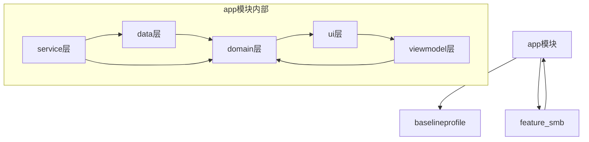
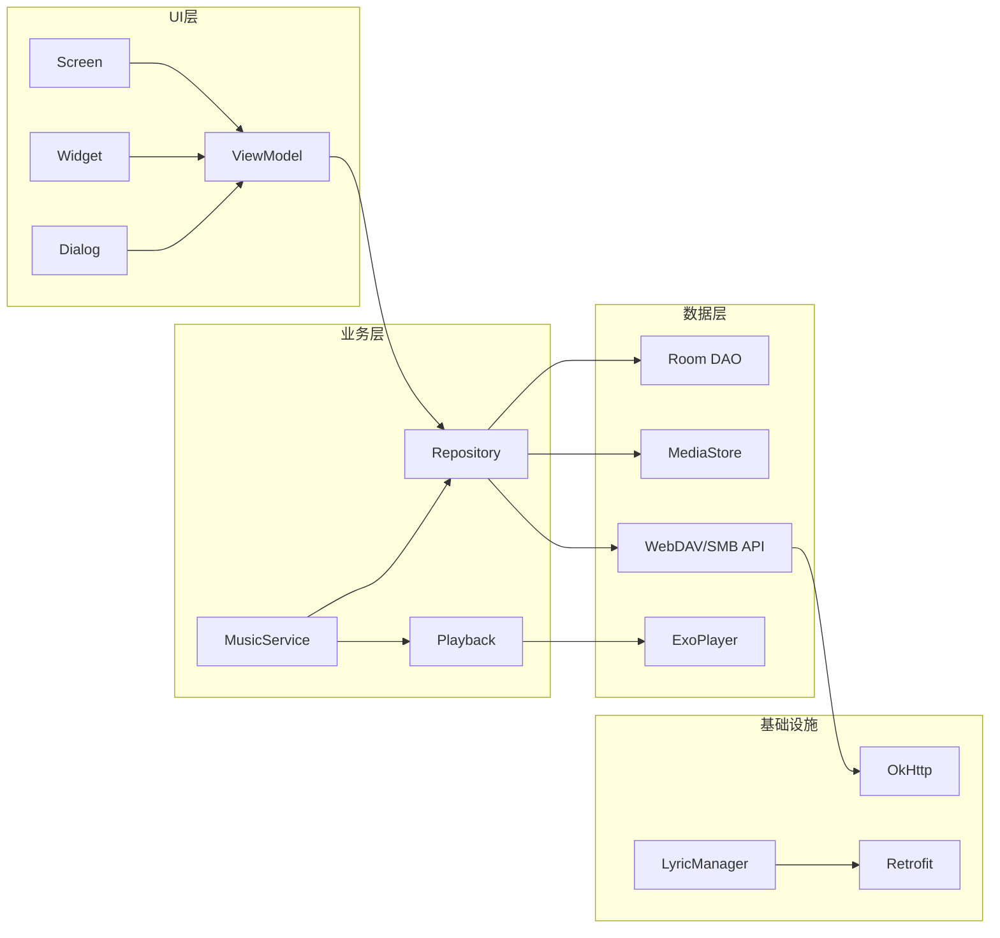

# 第一部分：项目概览

## 1. 技术栈

| 类别 | 技术 | 版本 |
|------|------|------|
| 语言 | Kotlin | 1.9+ (JVM Target 17) |
| UI框架 | Jetpack Compose | Material3 |
| 播放器 | ExoPlayer (Media3) | 1.x |
| 数据库 | Room | 2.x |
| 依赖注入 | Hilt | 2.x |
| 网络 | Retrofit + OkHttp | 2.x |
| 图片加载 | Glide | 4.x |
| 序列化 | Kotlinx Serialization | 1.x |

## 2. Android版本

- **Compile SDK**: 35
- **Target SDK**: 35
- **Min SDK**: 21 (Android 5.0)

## 3. Kotlin版本

- JVM Toolchain: 17
- Kotlin Compiler Extension: Managed by Compose BOM

## 4. Compose版本

- 使用 AndroidX Compose BOM 管理版本
- Material3 主题系统

## 5. Gradle结构

```
APlayer/
├── build.gradle.kts              # 根项目配置，插件版本管理
├── settings.gradle.kts           # 模块注册，仓库配置
├── app/
│   └── build.gradle.kts          # 主应用模块配置
├── baselineprofile/
│   └── build.gradle.kts          # 性能基准测试模块
└── feature_smb/
    └── build.gradle.kts          # SMB功能动态模块
```

## 6. 第三方库

| 库 | 用途 |
|----|------|
| `media3-exoplayer` | 核心播放器引擎 |
| `lib-decoder-ffmpeg` | FFmpeg解码支持 |
| `room-runtime/ktx/compiler` | 本地数据库 |
| `hilt-android` | 依赖注入 |
| `retrofit` | 网络请求 |
| `glide` | 图片加载 |
| `material/material3` | UI组件 |
| `xxpermissions` | 权限处理 |
| `sardine-android` | WebDAV客户端 |
| `timber` | 日志 |
| `leakcanary` | 内存泄漏检测 |
| `palette-ktx` | 颜色提取 |
| `work-runtime-ktx` | 后台任务 |

## 7. 模块关系



---

# 第二部分：目录分析

## app/src/main/java/remix/myplayer/

### data/

**职责**: 数据模型、数据库操作、偏好设置

**子目录**:
- `db/room/`: Room数据库实体和DAO
- `model/audio/`: 音频数据模型(Song, Album, Artist等)
- `model/github/`: GitHub版本信息模型
- `model/lastfm/`: LastFM封面数据模型
- `model/qq/`: QQ歌词搜索模型
- `model/smb/`: SMB文件模型
- `prefs/`: 偏好设置封装

**设计原因**: 遵循MVVM架构，数据层与UI层分离

**依赖**: Room, Kotlinx Serialization

### di/

**职责**: Hilt依赖注入模块配置

**文件**:
- `AppModule.kt`: 应用级别依赖
- `DatabaseModule.kt`: 数据库依赖
- `LyricProviderModule.kt`: 歌词提供者依赖
- `NetworkModule.kt`: 网络模块依赖
- `RepositoryModule.kt`: 仓库依赖
- `SmbModule.kt`: SMB模块依赖

**设计原因**: 使用Hilt实现依赖注入，解耦组件

### glide/

**职责**: Glide图片加载扩展

**文件**:
- `APlayerGlideModule.kt`: Glide模块配置
- `AudioFileCoverUtils.kt`: 音频封面提取
- `EmbeddedFetcher/Loader.kt`: 内嵌封面加载
- `UriFetcher.kt`: URI封面加载

**设计原因**: 自定义Glide加载器处理音频文件封面

### helper/

**职责**: 辅助工具类

**文件**:
- `AppMigration.kt`: 应用迁移
- `AudioTagWriter.kt`: 标签写入
- `EQHelper.kt`: 均衡器
- `ItemsSorter.kt`: 数据排序
- `LanguageHelper.kt`: 语言切换
- `ShakeDetector.kt`: 摇一摇检测
- `SleepTimer.kt`: 睡眠定时
- `SortOrder.kt`: 排序常量

### lyric/

**职责**: 歌词管理和搜索

**子目录**:
- `decrypt/`: 歌词解密(KuGou, NetEase, QQ)
- `provider/`: 歌词提供者(网络/本地/内嵌)

**核心文件**:
- `LyricManager.kt`: 歌词管理器
- `LyricSearcher.kt`: 歌词搜索器
- `LrcParser.kt`: LRC解析器

**设计原因**: 策略模式，支持多种歌词来源

### misc/

**职责**: 杂项功能

**子目录**:
- `cache/`: 磁盘缓存
- `floatpermission/`: 悬浮窗权限
- `log/`: 日志系统
- `manager/`: 管理器(Activity, DynamicModule, Service)
- `receiver/`: 广播接收器
- `update/`: 应用更新

### repo/

**职责**: 数据仓库层

**文件**:
- `AbstractRepository.kt`: 基础仓库类
- `SongRepository.kt`: 歌曲数据
- `AlbumRepository.kt`: 专辑数据
- `ArtistRepository.kt`: 艺术家数据
- `FolderRepository.kt`: 文件夹数据
- `GenreRepository.kt`: 流派数据
- `PlayListRepository.kt`: 播放列表
- `PlayQueueRepository.kt`: 播放队列
- `HistoryRepository.kt`: 播放历史
- `WebDavRepository.kt`: WebDAV配置
- `SmbRepository.kt`: SMB配置
- `usecase/`: 用例层

**设计原因**: 仓库模式，统一数据访问入口

### request/

**职责**: 网络请求客户端

**子目录**:
- `kugou/`: 酷狗歌词API
- `netease/`: 网易云歌词API
- `qq/`: QQ音乐歌词API
- `network/`: 网络工具类

### service/

**职责**: 后台服务

**子目录**:
- `notification/`: 通知栏实现
- `playback/`: 播放核心(ExoPlayback, Playback接口)

**核心文件**:
- `MusicService.kt`: 音乐播放服务
- `AudioFocusManager.kt`: 音频焦点管理
- `MediaSessionUpdater.kt`: MediaSession更新
- `AppWidgetUpdater.kt`: 桌面部件更新
- `VolumeController.kt`: 音量控制

### ui/

**职责**: 用户界面

**子目录**:
- `activity/`: Activity基类和锁屏页
- `appshortcuts/`: 应用快捷方式
- `appwidgets/`: 桌面部件
- `blur/`: 模糊效果
- `dialog/`: 对话框组件
- `nav/`: Compose Navigation配置
- `screen/`: 各个页面
- `state/`: UI状态
- `theme/`: 主题系统
- `widget/`: 自定义UI组件

### util/

**职责**: 工具类

**子目录**:
- `ext/`: Kotlin扩展函数

### viewmodel/

**职责**: ViewModel层

**文件**:
- `MainViewModel.kt`: 主界面
- `PlaybackViewModel.kt`: 播放控制
- `LibraryViewModel.kt`: 媒体库
- `WebDavViewModel.kt`: WebDAV
- `SmbViewModel.kt`: SMB
- `SettingViewModel.kt`: 设置

---

## 模块依赖关系

