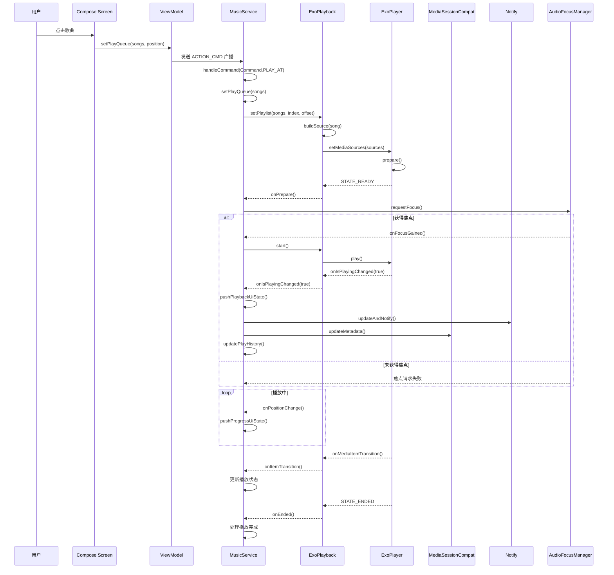
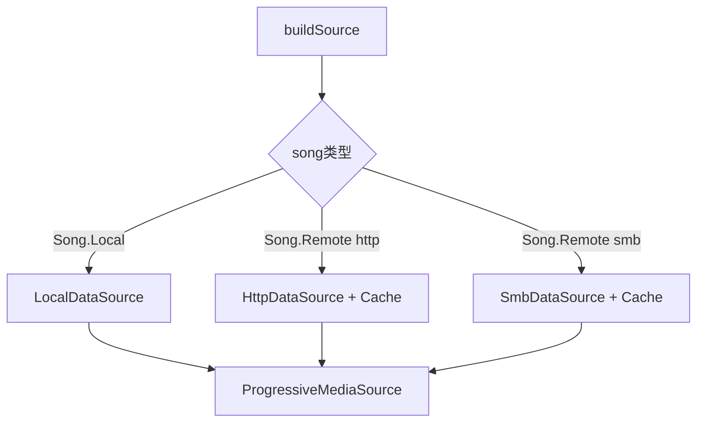
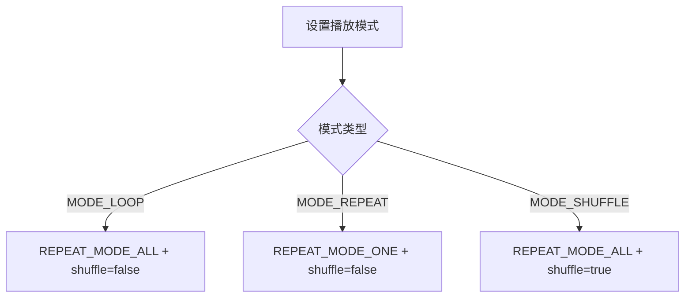
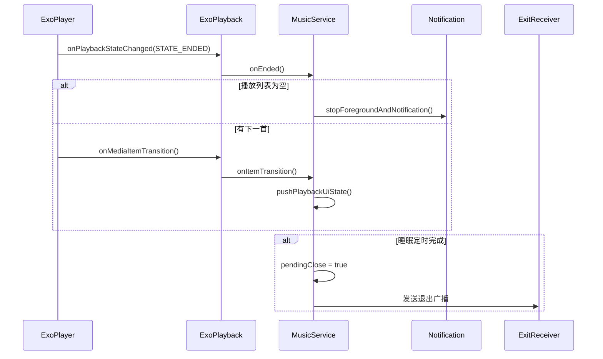
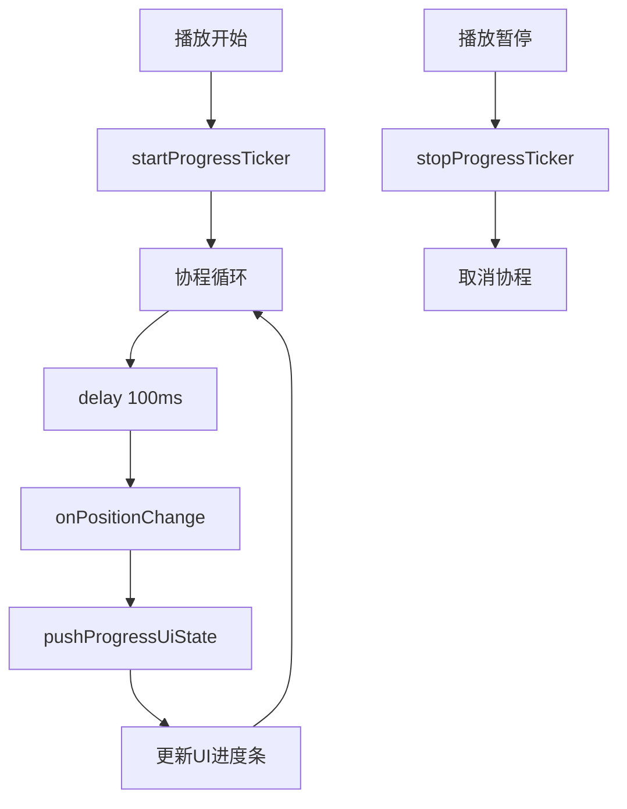
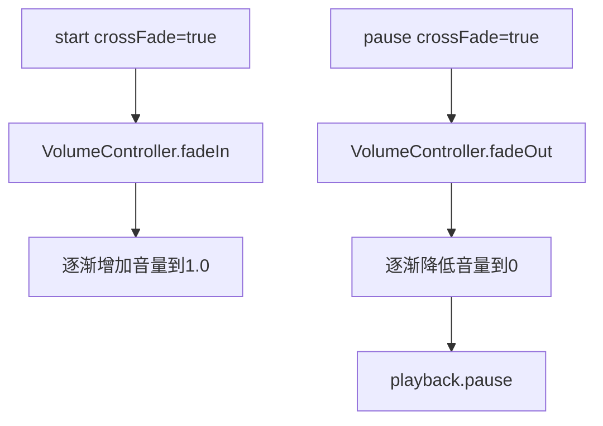

# 第三部分：播放流程

## 完整播放流程图



## 详细步骤分析

### 1. 用户点击歌曲

用户在任意列表页面点击歌曲，触发播放流程。

### 2. ViewModel处理

`PlaybackViewModel` 或 `LibraryViewModel` 接收点击事件，通过广播方式通知 `MusicService`。

**关键代码**:
```kotlin
// LibraryViewModel.kt
fun playSongs(songs: List<Song>, position: Int) {
    MusicServiceRemote.setPlayQueue(songs, Intent().apply {
        putExtra(MusicService.EXTRA_COMMAND, Command.PLAY_AT)
        putExtra(MusicService.EXTRA_POSITION, position)
    })
}
```

### 3. MusicService接收命令

`MusicService` 通过 `ControlReceiver` 接收广播命令，调用 `handleCommand()` 方法处理。

**命令类型**:
| 命令 | 含义 |
|------|------|
| `Command.PLAY_AT` | 从指定位置播放 |
| `Command.SKIP_TO_NEXT` | 下一首 |
| `Command.SKIP_TO_PREVIOUS` | 上一首 |
| `Command.PLAY_PAUSE` | 播放/暂停切换 |

### 4. 设置播放队列

`setPlayQueue()` 方法：
1. 检查队列是否为空或与当前队列相同
2. 调用 `playback.setPlaylist()` 设置队列
3. 更新 MediaSession 队列
4. 保存到 PlayQueueStore

### 5. ExoPlayback构建媒体源

`buildSource()` 根据歌曲类型构建不同的 `MediaSource`:



### 6. ExoPlayer准备

`ExoPlayer.prepare()` 触发异步准备，准备完成后回调 `onPrepare()`。

### 7. 音频焦点请求

`AudioFocusManager.requestFocus()` 请求系统音频焦点：
- `AUDIOFOCUS_GAIN`: 获得焦点，开始播放
- `AUDIOFOCUS_LOSS`: 失去焦点，暂停播放
- `AUDIOFOCUS_LOSS_TRANSIENT`: 短暂失去焦点
- `AUDIOFOCUS_LOSS_TRANSIENT_CAN_DUCK`: 音量降低

### 8. 开始播放

获得焦点后调用 `playback.start()` -> `player.play()`。

### 9. 更新UI状态

`pushPlaybackUiState()` 更新全局播放状态，通过 `MusicStateSource` 流通知所有监听者。

### 10. 更新通知栏

`Notify.updateAndNotify()` 根据 API 版本选择不同实现：
- `NotifyImpl`: Android N 以下
- `NotifyImpl24`: Android N 及以上

### 11. 更新MediaSession

`MediaSessionUpdater.updateMetadata()` 更新锁屏控制信息。

### 12. 保存播放历史

`updatePlayHistory()` 只在歌曲真实开始播放时写入数据库。

---

## 播放模式处理



播放模式通过 `Playback.setMode()` 转换为 ExoPlayer 的 `repeatMode` 和 `shuffleMode`。

---

## 播放完成处理



---

## 进度更新机制



进度通过协程每100ms更新一次，确保UI流畅显示。

---

## 音量渐变效果



支持淡入淡出效果，提升用户体验。