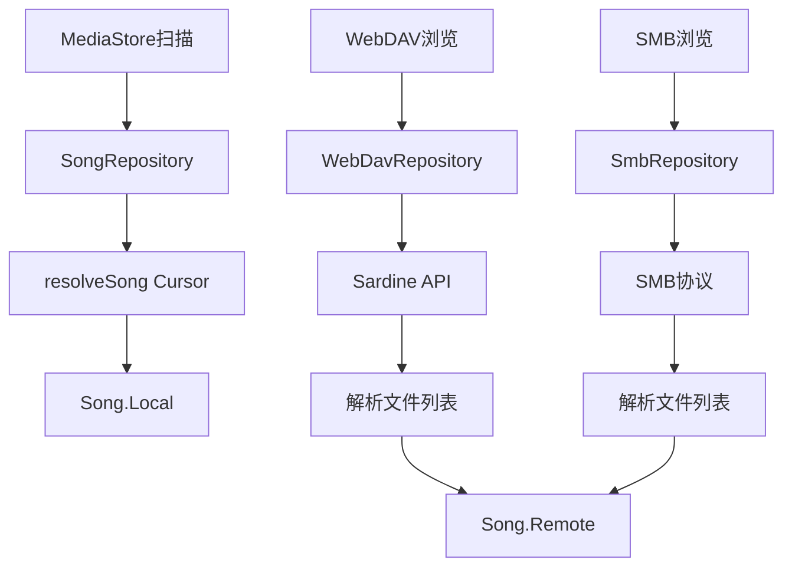
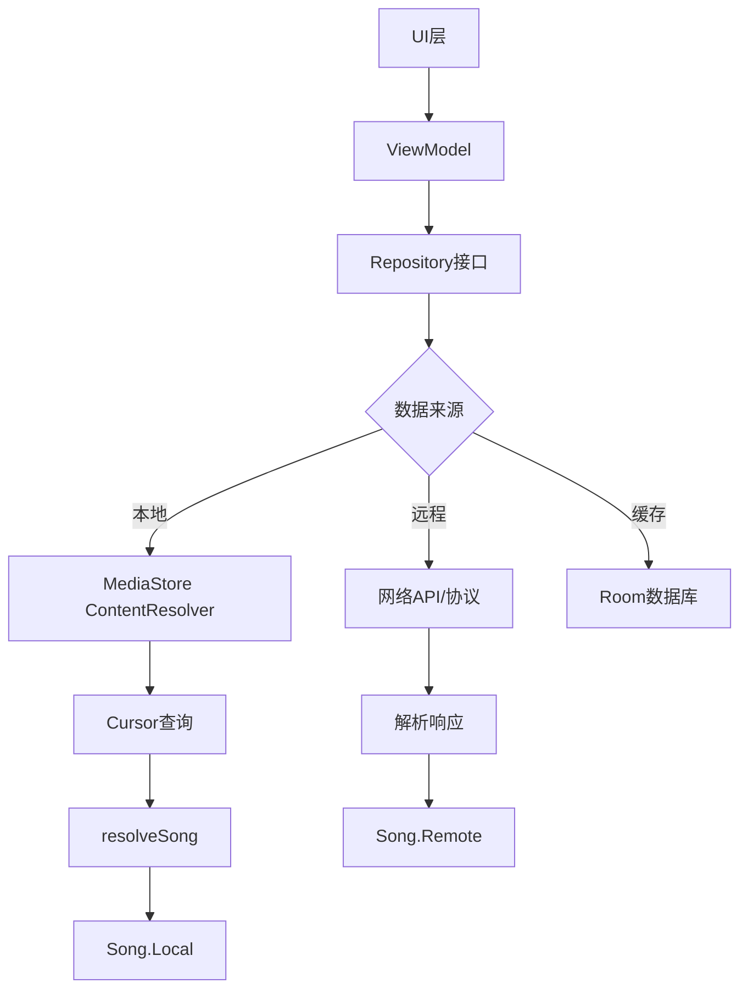
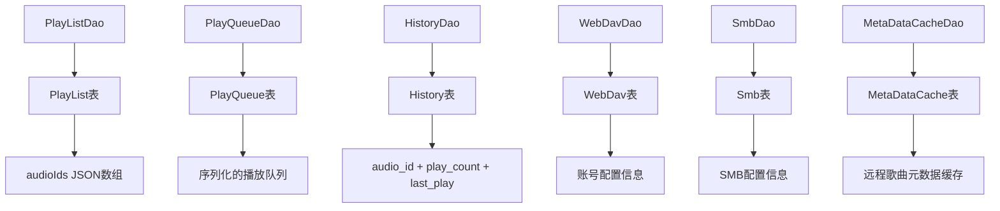
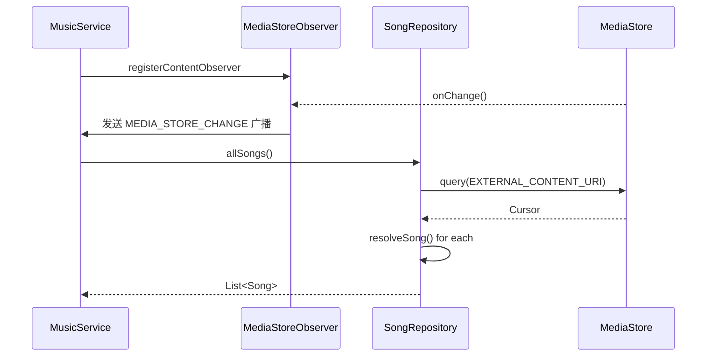
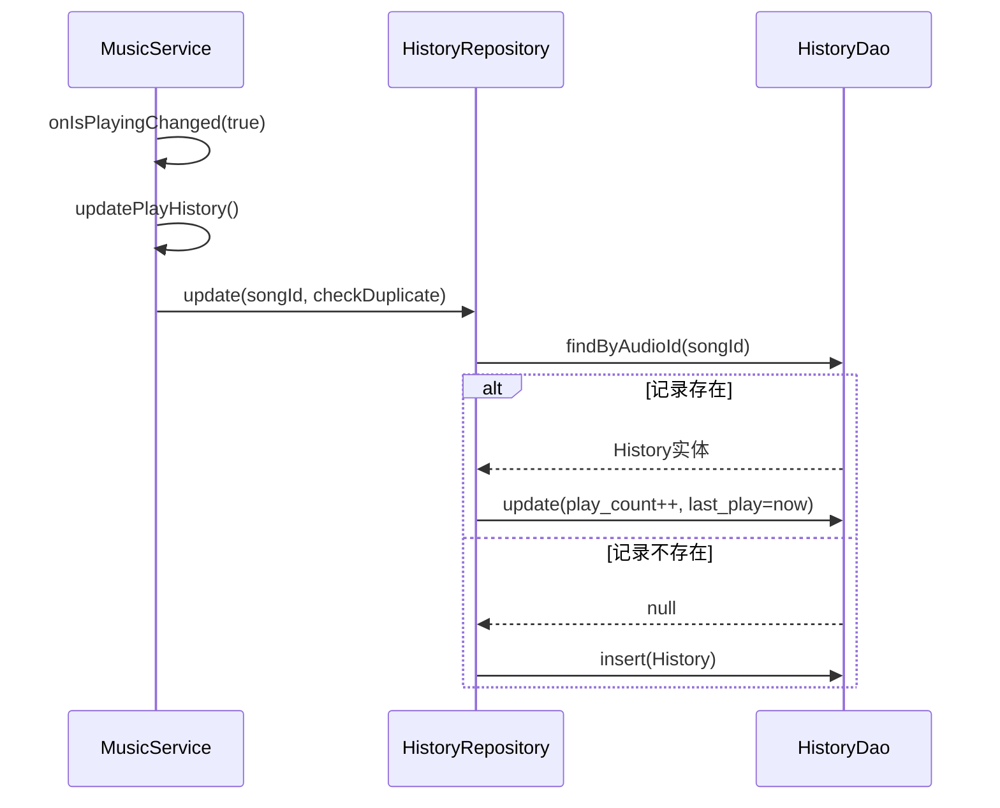
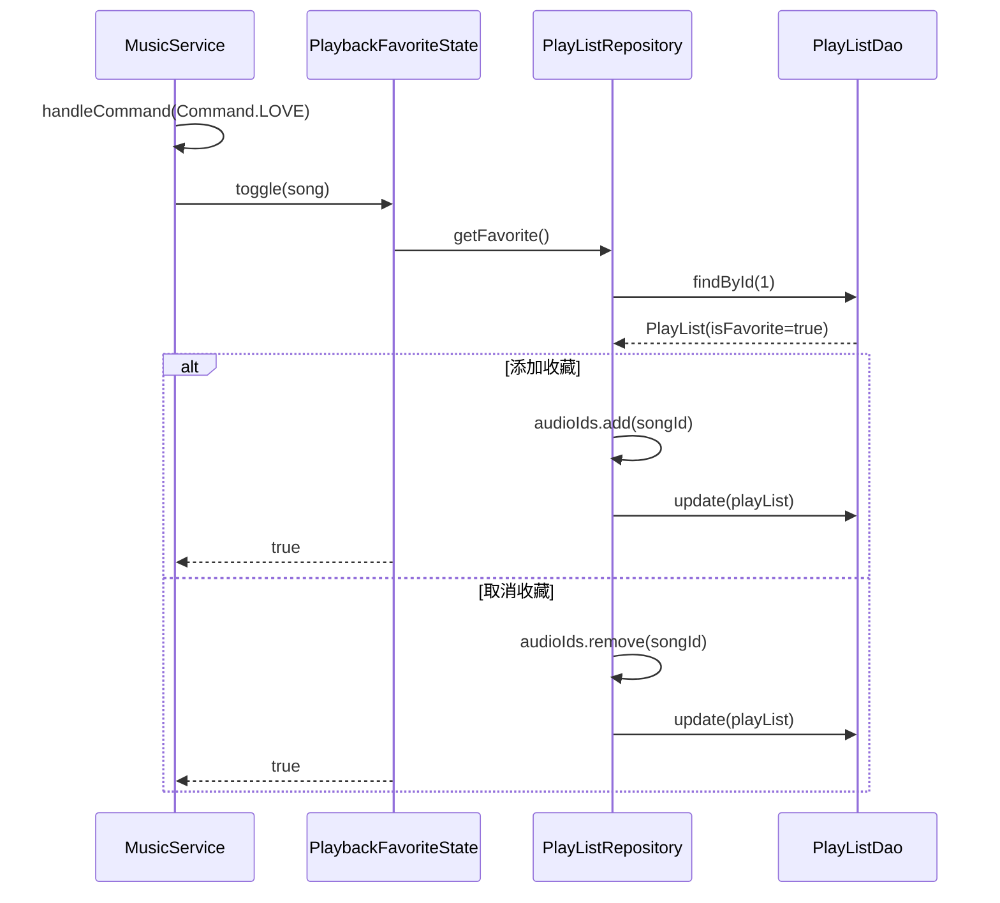
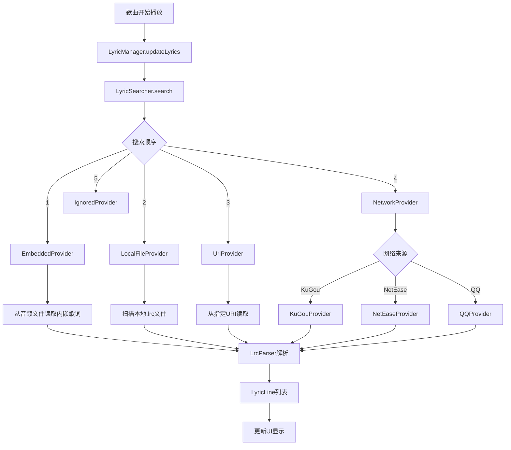
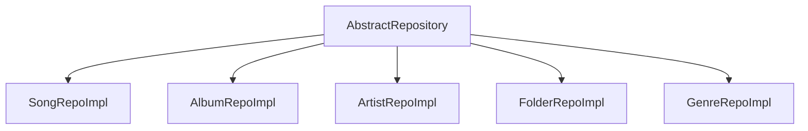
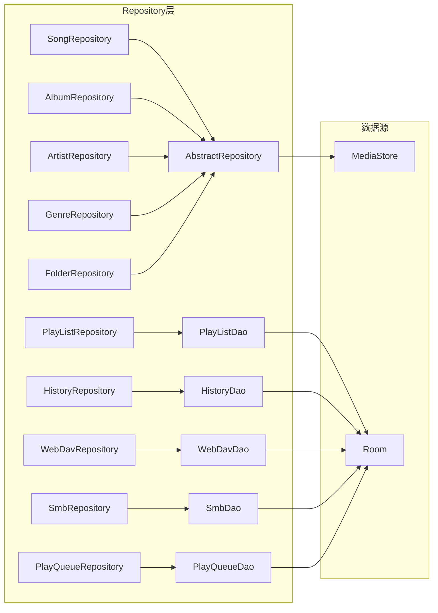

# 第四部分：数据流 & 第五部分：Repository

## 数据流分析

### Song对象创建流程



**Song.Local**: 从 MediaStore Cursor 创建，包含完整元数据。

**Song.Remote**: 从远程文件列表创建，初始只有基本信息，通过 `FetchMetaDataUseCase` 异步获取详细元数据。

---

### Repository工作机制



所有Repository遵循相同模式：
1. ViewModel调用Repository接口方法
2. Repository根据数据来源选择不同实现
3. 返回统一的数据模型

---

### Room存储机制



---

### MediaStore扫描流程



**扫描过滤器** (在 `AbstractRepository.baseSelection`):
- `_data != ''`: 排除空路径
- `SIZE > settingPrefs.scanSize`: 排除过小文件
- `_ID NOT IN deleteIds`: 排除已删除歌曲
- `DATA NOT LIKE blacklist%`: 排除黑名单目录

---

### 播放历史保存流程



---

### 收藏保存流程



收藏通过特殊的 PlayList(id=1) 实现。

---

### 歌词关联流程



---

## Repository详细分析

### 1. AbstractRepository

**基类职责**:
- `baseSelection`: 构建基础查询条件
- `baseSelectionArgs`: 构建查询参数
- `baseProjection`: 定义查询字段
- `resolveSong()`: 从 Cursor 解析 Song 对象

**继承关系**:


### 2. SongRepository

**核心方法**:

| 方法 | 功能 |
|------|------|
| `allSongs()` | 获取所有本地歌曲 |
| `getSongs(selection, selectionValues, sortOrder)` | 条件查询 |
| `song(id)` | 根据ID获取单首歌曲 |
| `getSongsByModels(models)` | 根据模型获取歌曲列表 |
| `getSongsByGenreId(genreId)` | 根据流派获取歌曲 |
| `getLastAddedSongs()` | 获取最近添加的歌曲 |

**`getSongsByModels()` 支持的模型**:
- `Song`: 直接返回
- `Album`: 查询 `ALBUM_ID = ?`
- `Artist`: 查询 `ARTIST_ID = ?`
- `Genre`: 通过 `Genres.Members` 查询
- `Folder`: 过滤路径匹配
- `PlayList`: 查询 `audioIds` 列表中的歌曲

### 3. PlayListRepository

**核心功能**:
- 歌单CRUD操作
- 收藏功能（id=1的特殊歌单）
- 自定义排序支持

**歌单存储结构**:
```kotlin
data class PlayList(
    val id: Long,
    val name: String,
    val audioIds: ArrayList<Long>,  // JSON序列化存储
    val date: Long
)
```

### 4. HistoryRepository

**播放历史统计**:
- 记录播放次数
- 记录最后播放时间
- 支持去重检查

### 5. WebDavRepository & SmbRepository

**远程配置管理**:
- 保存/读取连接配置
- 账号密码加密存储
- 支持多个连接

### 6. UseCase层

**用例类**:
- `DeleteSongUseCase`: 删除歌曲
- `ExportPlayListUseCase`: 导出歌单
- `FetchMetaDataUseCase`: 获取远程歌曲元数据
- `PlayFromUriUseCase`: 从URI播放

---

## Repository依赖关系



---

## 关键设计特点

1. **统一接口**: 所有Repository都有接口定义，便于测试和替换
2. **本地优先**: 本地歌曲通过MediaStore直接读取，不缓存到Room
3. **远程延迟加载**: Remote歌曲先创建轻量对象，再异步获取元数据
4. **策略模式**: 歌词搜索采用策略模式，支持多种来源
5. **Hilt注入**: Repository通过Hilt注入，解耦依赖关系