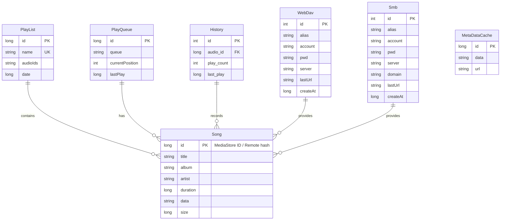
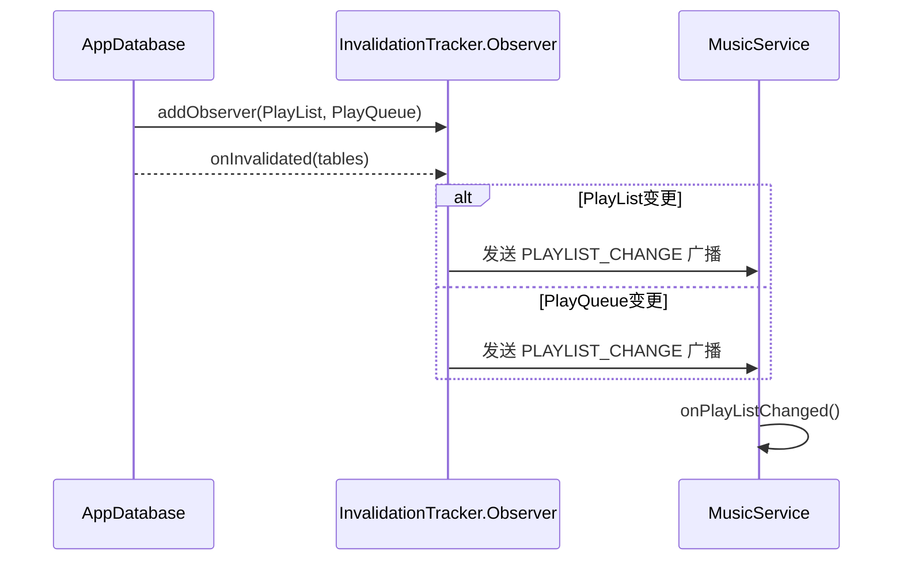

# 第五部分：数据库

## 数据库配置

**数据库名称**: `aplayer.db`

**当前版本**: 7

**迁移历史**:
| 版本 | 变更 |
|------|------|
| 1→3 | 空迁移 |
| 3→4 | 未知变更 |
| 4→5 | 未知变更 |
| 5→6 | 未知变更 |
| 6→7 | 未知变更 |

**文件位置**: `/data/data/remix.myplayer/databases/aplayer.db`

---

## 所有Entity

### 1. PlayList

```kotlin
@Entity(indices = [Index(value = ["name"], unique = true)])
data class PlayList(
    @PrimaryKey(autoGenerate = true) val id: Long,
    val name: String,
    val audioIds: ArrayList<Long>,  // JSON序列化
    val date: Long
)
```

**特殊约定**:
- `id = 1` 为"我的收藏"歌单
- `audioIds` 存储歌曲ID列表，JSON序列化

**数据库表**:
```sql
CREATE TABLE PlayList (
    id INTEGER PRIMARY KEY AUTOINCREMENT,
    name TEXT NOT NULL,
    audioIds TEXT NOT NULL,
    date INTEGER NOT NULL
);
CREATE UNIQUE INDEX index_PlayList_name ON PlayList(name);
```

---

### 2. PlayQueue

```kotlin
@Entity
data class PlayQueue(
    @PrimaryKey(autoGenerate = true) val id: Long,
    val queue: String,           // JSON序列化的歌曲列表
    val currentPosition: Int,    // 当前播放位置
    val lastPlay: Long           // 最后播放时间
)
```

**用途**: 持久化播放队列，应用重启后恢复播放状态

---

### 3. History

```kotlin
@Entity
data class History(
    @PrimaryKey(autoGenerate = true) val id: Int,
    val audio_id: Long,          // 歌曲ID
    val play_count: Int,         // 播放次数
    val last_play: Long          // 最后播放时间
)
```

**用途**: 播放历史统计

---

### 4. WebDav

```kotlin
@Entity
data class WebDav(
    var alias: String,           // 别名
    var account: String,         // 账号
    var pwd: String,             // 密码（明文存储）
    var server: String,          // 服务器地址
    var lastUrl: String,         // 上次浏览路径
    val createAt: Long = System.currentTimeMillis()
) {
    @PrimaryKey(autoGenerate = true) var id: Int = 0
}
```

**安全风险**: 密码明文存储，建议加密

---

### 5. Smb

```kotlin
@Entity
data class Smb(
    var alias: String,
    var account: String,
    var pwd: String,
    var server: String,
    var domain: String,
    var lastUrl: String,
    val createAt: Long = System.currentTimeMillis()
) {
    @PrimaryKey(autoGenerate = true) var id: Int = 0
}
```

---

### 6. MetaDataCache

```kotlin
@Entity
data class MetaDataCache(
    @PrimaryKey val id: Long,
    val data: String,            // 缓存数据
    val url: String              // 对应URL
)
```

**用途**: 缓存远程歌曲的元数据信息

---

## 所有DAO

### 1. PlayListDao

| 方法 | 功能 |
|------|------|
| `findById(id)` | 根据ID查询 |
| `findAll()` | 查询所有 |
| `findByName(name)` | 根据名称查询 |
| `insert(playList)` | 插入 |
| `update(playList)` | 更新 |
| `delete(playList)` | 删除 |

---

### 2. PlayQueueDao

| 方法 | 功能 |
|------|------|
| `getQueue()` | 获取播放队列 |
| `insertOrReplace(playQueue)` | 插入或替换 |
| `clear()` | 清空 |

---

### 3. HistoryDao

| 方法 | 功能 |
|------|------|
| `findByAudioId(audioId)` | 根据歌曲ID查询 |
| `findAll()` | 查询所有 |
| `insert(history)` | 插入 |
| `update(history)` | 更新 |
| `delete(history)` | 删除 |
| `clear()` | 清空 |

---

### 4. WebDavDao

| 方法 | 功能 |
|------|------|
| `selectAll()` | 查询所有（Flow） |
| `findById(id)` | 根据ID查询 |
| `insertOrReplace(webDav)` | 插入或替换 |
| `delete(webDav)` | 删除 |

---

### 5. SmbDao

| 方法 | 功能 |
|------|------|
| `selectAll()` | 查询所有（Flow） |
| `findById(id)` | 根据ID查询 |
| `insertOrReplace(smb)` | 插入或替换 |
| `delete(smb)` | 删除 |

---

### 6. MetaDataCacheDao

| 方法 | 功能 |
|------|------|
| `findByUrl(url)` | 根据URL查询 |
| `insertOrReplace(cache)` | 插入或替换 |
| `deleteByUrl(url)` | 根据URL删除 |

---

## 所有Repository

| Repository | 接口 | 实现类 | 数据源 |
|------------|------|--------|--------|
| 歌曲 | `SongRepository` | `SongRepoImpl` | MediaStore |
| 专辑 | `AlbumRepository` | `AlbumRepoImpl` | MediaStore |
| 艺术家 | `ArtistRepository` | `ArtistRepoImpl` | MediaStore |
| 流派 | `GenreRepository` | `GenreRepoImpl` | MediaStore |
| 文件夹 | `FolderRepository` | `FolderRepoImpl` | MediaStore |
| 播放列表 | `PlayListRepository` | `PlayListRepoImpl` | Room |
| 播放队列 | `PlayQueueRepository` | `PlayQueueRepoImpl` | Room |
| 播放历史 | `HistoryRepository` | `HistoryRepoImpl` | Room |
| WebDAV | `WebDavRepository` | `WebDavRepoImpl` | Room |
| SMB | `SmbRepository` | `SmbRepoImpl` | Room |

---

## ER图



---

## 数据关系说明

### 播放列表与歌曲

`PlayList.audioIds` 存储歌曲ID的JSON数组，不使用外键关联。这种设计的优缺点：

**优点**:
- 查询简单，一次读取即可获取所有歌曲ID
- 支持自定义排序顺序

**缺点**:
- 无法利用数据库级联删除
- 当歌曲被删除时需要手动清理（已在 `getSongsByModels()` 中处理）
- JSON解析有一定开销

### 播放队列

`PlayQueue.queue` 存储完整的 `List<Song>` 序列化数据，包含所有歌曲信息。这种设计：

**优点**:
- 快速恢复，无需再次查询MediaStore
- 支持远程歌曲持久化

**缺点**:
- 数据冗余
- 本地歌曲信息变更时，队列中的数据不会自动更新

### 播放历史

`History.audio_id` 关联本地歌曲ID，远程歌曲不记录历史。

---

## 数据库监听机制



通过Room的 `InvalidationTracker` 监听表变更，自动通知Service更新UI。

---

## 潜在问题

### 1. 密码明文存储

**问题**: `WebDav.pwd` 和 `Smb.pwd` 明文存储在数据库中

**建议**: 使用 `EncryptedSharedPreferences` 或加密数据库

### 2. 无外键约束

**问题**: 各表之间没有外键约束，数据一致性依赖代码保证

**建议**: 对于经常关联查询的表添加外键约束

### 3. JSON数组存储

**问题**: `audioIds` 使用JSON序列化存储，无法利用数据库查询优化

**建议**: 考虑使用关联表（但会增加复杂度）

### 4. 无数据库清理机制

**问题**: 删除歌曲时，History和PlayList中的引用需要手动清理

**现状**: 已在 `getSongsByModels()` 中实现清理逻辑