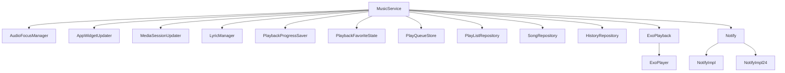
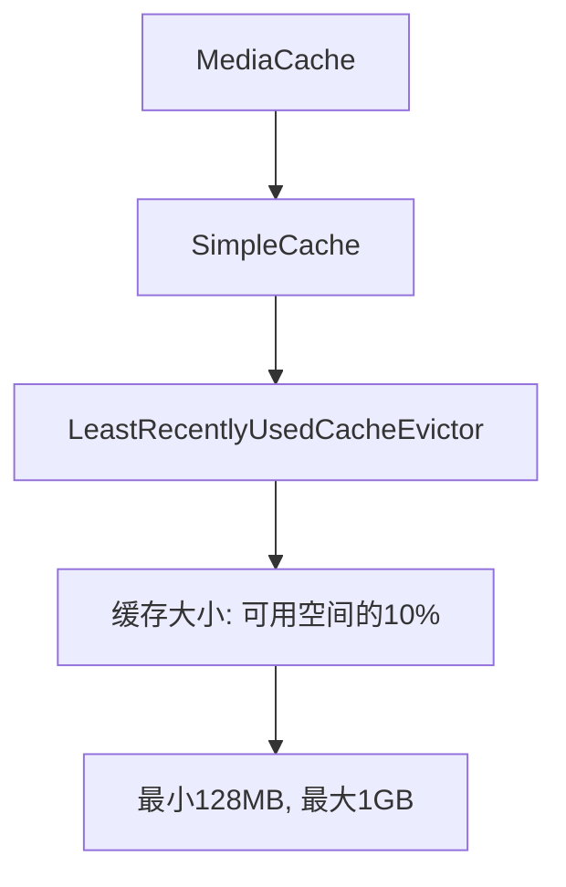
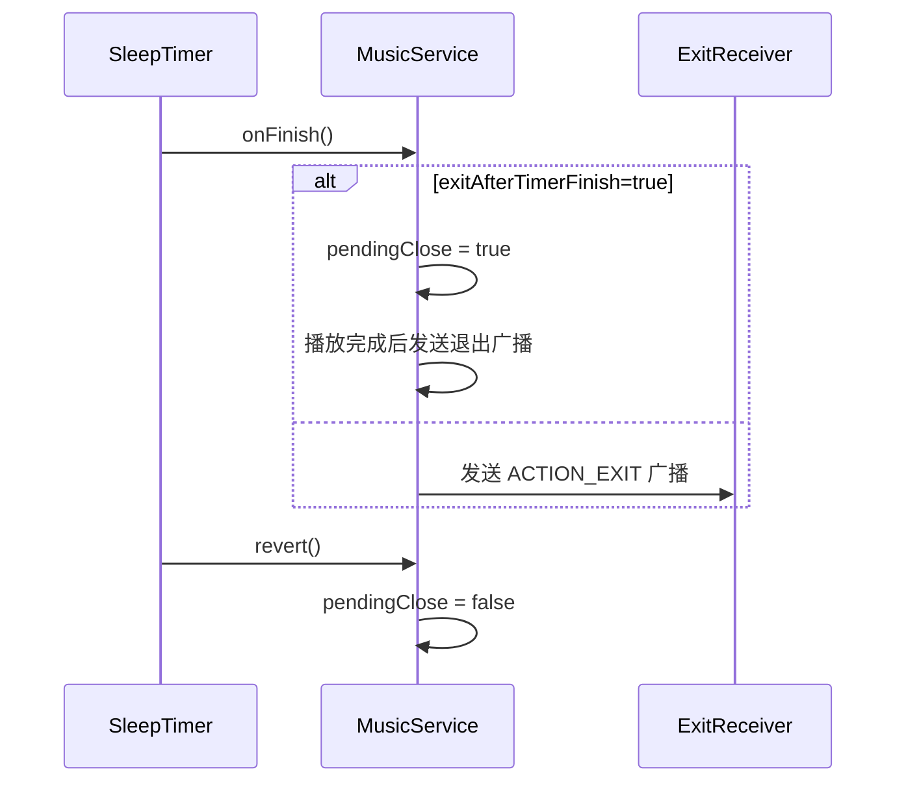
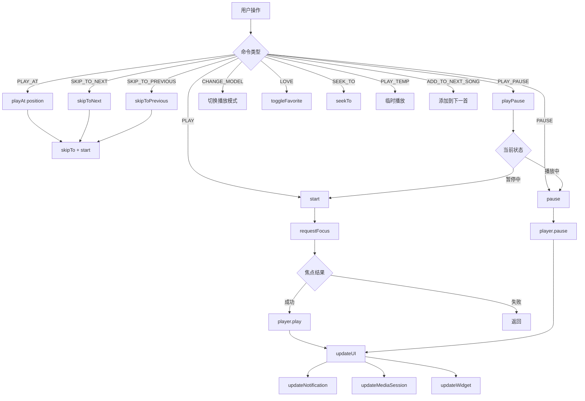
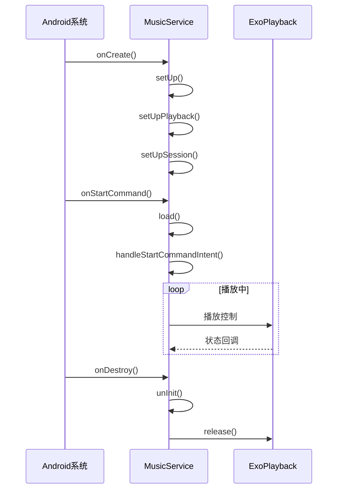
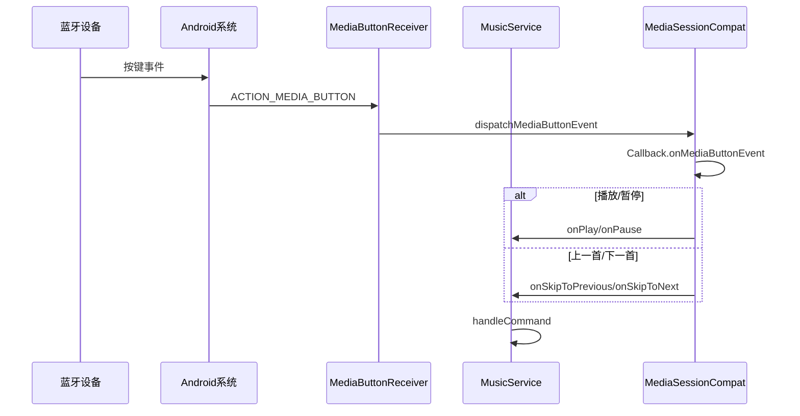
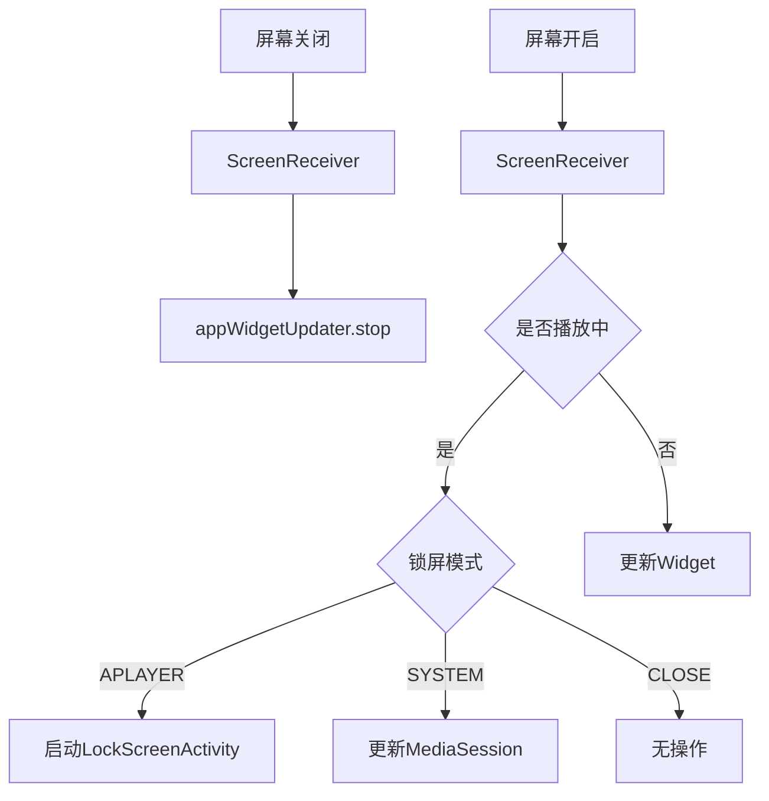

# 第七部分：播放器

## MusicService 架构



---

## PlayerService 详细分析

### 核心组件

#### 1. ExoPlayback

**职责**: 封装 ExoPlayer，提供统一的播放控制接口

**关键方法**:

| 方法 | 功能 |
|------|------|
| `setPlaylist(songs, index, offset)` | 设置播放队列 |
| `start()` | 开始播放（包含音频焦点请求） |
| `pause()` | 暂停播放 |
| `skipToNext()` | 下一首 |
| `skipToPrevious()` | 上一首 |
| `skipTo(index)` | 跳转到指定位置 |
| `seek(pos)` | 进度跳转 |
| `setMode(mode, listLoop)` | 设置播放模式 |
| `setSpeed(speed)` | 设置播放速度 |
| `addToNextSong(song)` | 添加到下一首 |

**支持的歌曲类型**:
- `Song.Local`: 本地文件，使用 `DefaultDataSource`
- `Song.Remote(http)`: WebDAV，使用 `DefaultHttpDataSource` + 缓存
- `Song.Remote(smb)`: SMB，使用 `SmbDataSource` + 缓存

**缓存机制**:


#### 2. AudioFocusManager

**职责**: 管理系统音频焦点

**焦点状态**:

| 状态 | 触发场景 | 处理方式 |
|------|----------|----------|
| `AUDIOFOCUS_GAIN` | 获得焦点 | 恢复播放 |
| `AUDIOFOCUS_LOSS` | 永久失去焦点 | 暂停播放 |
| `AUDIOFOCUS_LOSS_TRANSIENT` | 短暂失去焦点 | 暂停播放，等待恢复 |
| `AUDIOFOCUS_LOSS_TRANSIENT_CAN_DUCK` | 需要降低音量 | 音量降至10% |

**自定义选项**:
- `ignoreAudioFocus`: 是否忽略音频焦点
- `shouldPauseForPhoneCall`: 是否在通话时暂停

#### 3. Notify（通知栏）

**双版本实现**:

| 版本 | 类名 | 特点 |
|------|------|------|
| < Android N | `NotifyImpl` | 传统通知栏 |
| >= Android N | `NotifyImpl24` | MediaStyle通知，支持进度条 |

**通知栏操作**:
- 上一首 / 播放/暂停 / 下一首
- 桌面歌词开关/解锁
- 关闭通知栏

**前台服务**:
- 播放时启动前台服务，防止被系统杀死
- 暂停时可选择是否保持前台

#### 4. MediaSession

**职责**: 与系统媒体控制交互

**功能**:
- 锁屏控制
- 车载蓝牙控制
- 耳机按键控制
- 系统音量键控制

**支持的操作**:
```kotlin
override fun onSkipToNext()
override fun onSkipToPrevious()
override fun onPlay()
override fun onPause()
override fun onStop()
override fun onSeekTo(pos: Long)
override fun onCustomAction(action: String?, extras: Bundle?)
```

**自定义Action**:
- `ACTION_UNLOCK_DESKTOP_LYRIC`: 解锁桌面歌词
- `ACTION_TOGGLE_DESKTOP_LYRIC`: 切换桌面歌词

#### 5. SleepTimer（睡眠定时）

**职责**: 定时停止播放

**功能**:
- 设置定时时长
- 定时完成后暂停或退出应用
- 支持开关定时

**回调机制**:


#### 6. PlaybackSpeed（播放速度）

**支持范围**: 0.5x - 2.0x

**实现方式**:
```kotlin
player.playbackParameters = PlaybackParameters(speed, pitch)
```

**注意**: 只修改speed，pitch保持不变，避免音调变化

#### 7. AppWidgetUpdater（桌面部件）

**支持的部件大小**:
- 小部件: 1x1
- 中部件: 2x2
- 大部件: 4x2

**透明/非透明主题**:
- 支持透明背景
- 支持自定义皮肤

**更新机制**:
- 屏幕开启时定时更新
- 屏幕关闭时停止更新

#### 8. VolumeController（音量控制器）

**功能**:
- 淡入淡出效果
- 直接设置音量

**淡入淡出时长**: 300ms

---

## 播放控制流程图



---

## 可修改项 vs 不可修改项

### 可以修改的部分

| 模块 | 修改内容 | 修改影响 |
|------|----------|----------|
| ExoPlayback | 添加新的 DataSource | 支持新的音频来源 |
| Notify | 修改通知栏样式 | UI变化 |
| SleepTimer | 修改定时逻辑 | 定时行为变化 |
| PlaybackSpeed | 修改速度范围 | 用户体验变化 |
| VolumeController | 修改淡入淡出时长 | 用户体验变化 |
| AudioFocusManager | 修改焦点策略 | 系统交互变化 |

### 不建议修改的部分

| 模块 | 原因 |
|------|------|
| MusicService | 核心播放逻辑，修改风险高 |
| MediaSession | 系统交互接口，修改可能导致兼容性问题 |
| PlayQueueStore | 播放队列持久化，修改可能导致数据丢失 |
| MusicStateSource | 全局状态管理，修改可能导致状态不一致 |
| ExoPlayer | 第三方库，不应直接修改 |

---

## 服务生命周期



**onCreate 初始化流程**:
1. 注册 SharedPreferences 监听
2. 创建 Notify 实例
3. 注册广播接收器（控制、事件、耳机、屏幕）
4. 注册 MediaStore Observer
5. 设置 SleepTimer 回调
6. 初始化 LyricManager
7. 绑定 AudioFocusManager
8. 创建 ExoPlayback
9. 创建 MediaSession
10. 启动状态收集协程

**onDestroy 清理流程**:
1. 停止进度保存
2. 取消收藏状态查询
3. 停止部件更新
4. 取消协程
5. 释放均衡器
6. 暂停播放
7. 释放 ExoPlayback
8. 停止通知栏
9. 释放 LyricManager
10. 释放 AudioFocusManager
11. 释放 MediaSession
12. 注销所有广播接收器
13. 注销 SharedPreferences 监听
14. 注销 MediaStore Observer
15. 停止摇一摇检测

---

## 蓝牙控制流程



---

## 锁屏控制



**锁屏模式**:
- `LOCKSCREEN_CLOSE`: 关闭锁屏控制
- `LOCKSCREEN_SYSTEM`: 使用系统锁屏
- `LOCKSCREEN_APLAYER`: 使用自定义锁屏Activity

---

## 性能优化点

### 1. 进度更新优化

```kotlin
private fun startProgressTicker() {
    progressTickerJob = scope.launch {
        while (isActive) {
            callback?.onPositionChange()
            delay(100)  // 100ms 更新一次
        }
    }
}
```

**优化方向**: 可以根据是否在播放页面动态调整更新频率

### 2. 缓存优化

当前缓存大小为可用空间的10%，最小128MB，最大1GB。可以考虑：
- 根据网络状态调整缓存策略
- 支持用户自定义缓存大小

### 3. 资源释放

当前在 `onDestroy` 中释放所有资源，但在低内存情况下可能不会触发 `onDestroy`。建议在 `onTrimMemory` 中也做适当的资源释放。