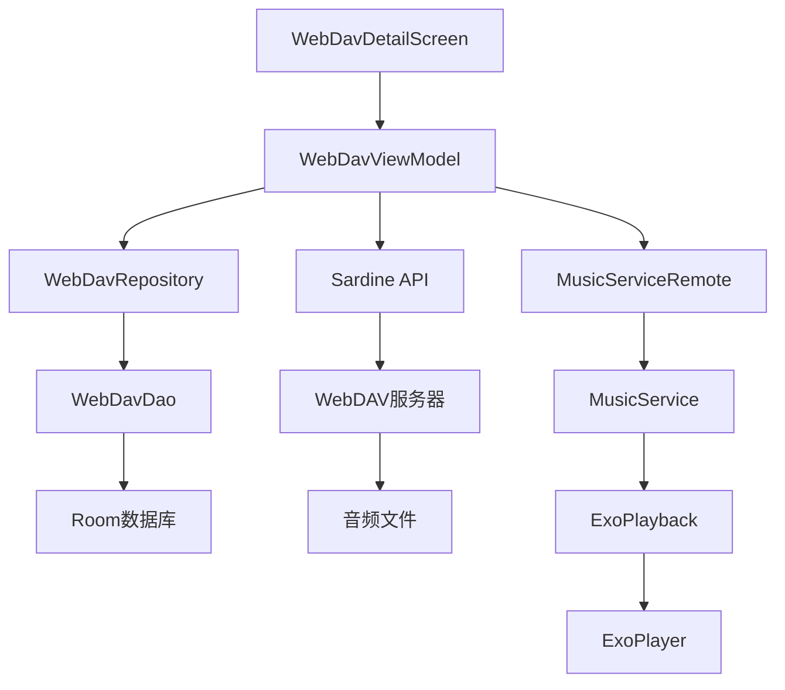
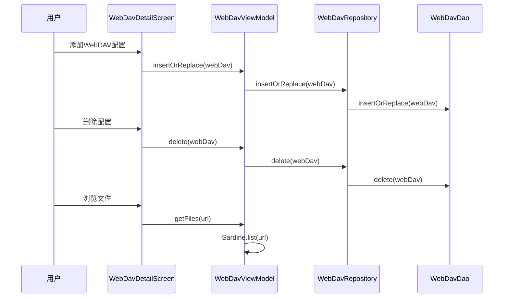
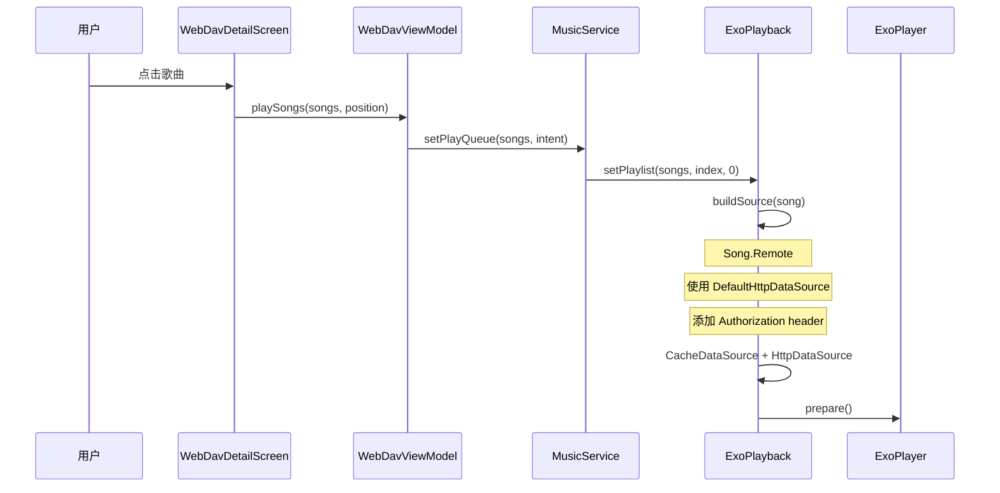
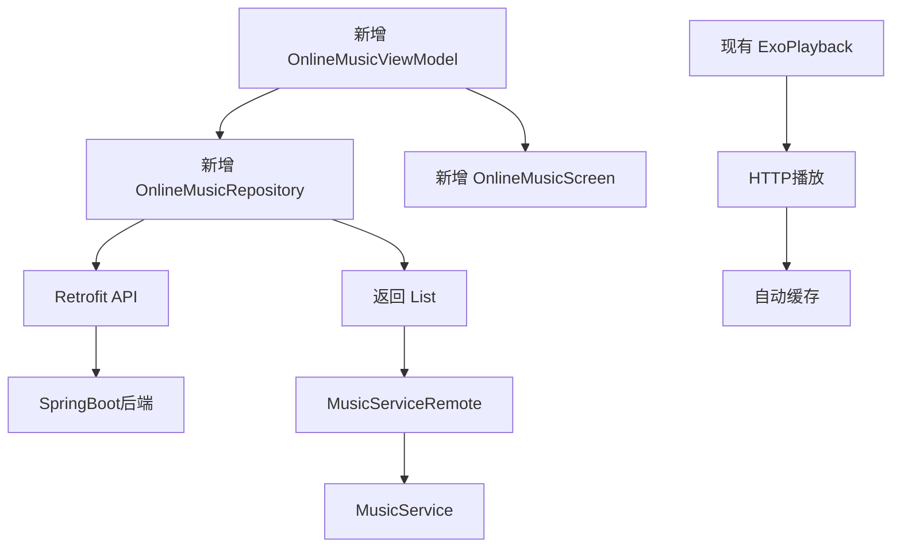
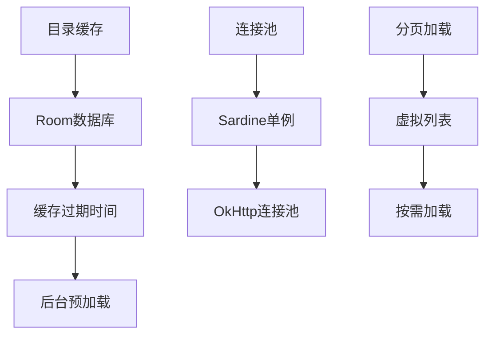

# 第八部分：WebDAV

## WebDAV 架构



---

## WebDAV 接入流程

### 1. 配置管理



### 2. 文件浏览

**核心代码流程**:

```kotlin
// WebDavViewModel.kt
suspend fun getFiles(url: String): List<Any> {
    val objects = sardine.list(url)
    val files = mutableListOf<Any>()
    
    for (obj in objects) {
        if (obj.isDirectory) {
            files.add(Folder(...))
        } else if (isAudioFile(obj.name)) {
            files.add(Song.Remote(...))
        }
    }
    
    return files
}
```

**支持的音频格式**: 根据 `MusicUtil.isAudioFile()` 判断

### 3. 播放流程



---

## Repository 实现

### WebDavRepository

```kotlin
interface WebDavRepository {
    fun allWebDav(): Flow<List<WebDav>>
    suspend fun insertOrReplace(webDav: WebDav): Long
    suspend fun delete(webDav: WebDav): Int
}
```

**实现类**: `WebDavRepoImpl`

**数据源**: Room数据库

### 数据模型

```kotlin
data class WebDav(
    var alias: String,           // 显示名称
    var account: String,         // 账号
    var pwd: String,             // 密码
    var server: String,          // 完整服务器地址
    var lastUrl: String,         // 上次浏览路径
    val createAt: Long = System.currentTimeMillis()
)
```

**辅助方法**:
- `base()`: 获取基础URL (scheme + host + port)
- `getRoot()`: 获取根路径
- `generateUrl(path)`: 生成完整URL
- `buildPathStack(currentUrl)`: 构建路径栈

---

## 播放器如何知道来源

### Song类型区分

```mermaid
graph TD
    A[Song] --> B{isLocal()}
    B -->|true| C[Song.Local]
    C --> D[MediaStore ID > 0]
    C --> E[本地文件路径]
    B -->|false| F[Song.Remote]
    F --> G{contentUri.scheme}
    G -->|smb| H[SMB数据源]
    G -->|http/https| I[HTTP数据源]
    I --> J[WebDAV]
    I --> K[在线音乐]
```

### ExoPlayback.buildSource()

```kotlin
private fun buildSource(song: Song): MediaSource {
    return if (song is Song.Remote) {
        if (song.contentUri.scheme == "smb") {
            // SMB数据源
            SmbDataSourceFactory() + Cache
        } else {
            // HTTP数据源（WebDAV/在线音乐）
            DefaultHttpDataSource.Factory()
                .setDefaultRequestProperties(song.headers) + Cache
        }
    } else {
        // 本地数据源
        DefaultDataSource.Factory(context)
    }
}
```

**关键**: `Song.Remote.headers` 包含 Authorization 信息

```kotlin
val headers by lazy {
    mapOf(
        "Authorization" to Credentials.basic(account, pwd)
    )
}
```

---

## 是否可复用扩展

### 复用 WebDAV 层支持 SpringBoot 在线音乐

**可以复用的部分**:

| 组件 | 复用方式 |
|------|----------|
| `Song.Remote` | 直接使用，data字段存储URL |
| `ExoPlayback.buildSource()` | HTTP数据源已支持任意URL |
| `FetchMetaDataUseCase` | 远程歌曲元数据获取 |
| 播放控制逻辑 | 完全复用 |
| 通知栏/MediaSession | 完全复用 |

**需要新增的部分**:

| 组件 | 说明 |
|------|------|
| `OnlineMusicRepository` | 获取在线音乐列表 |
| `OnlineMusicViewModel` | 在线音乐页面逻辑 |
| `OnlineMusicScreen` | 在线音乐页面 |
| 后端API客户端 | Retrofit接口 |

**修改最小化方案**:



**无需修改的核心代码**:
- `MusicService` - 播放控制
- `ExoPlayback` - 媒体源构建
- `Playback` - 播放接口
- `Notify` - 通知栏
- `MediaSessionUpdater` - 系统交互

---

## WebDAV 安全问题

### 密码明文存储

**问题**: 密码直接存储在Room数据库中，无加密

**风险**: 
- 数据库文件被窃取后密码泄露
- 应用数据备份包含明文密码

**建议**:
```kotlin
// 使用 EncryptedSharedPreferences 存储密码
val sharedPreferences = EncryptedSharedPreferences.create(
    "secure_prefs",
    masterKeyAlias,
    context,
    EncryptedSharedPreferences.PrefKeyEncryptionScheme.AES256_SIV,
    EncryptedSharedPreferences.PrefValueEncryptionScheme.AES256_GCM
)

// 或者使用 AndroidX Security 的 EncryptedFile
```

### HTTPS支持

**现状**: 支持HTTPS，但依赖服务器配置

**建议**: 
- 强制要求HTTPS连接
- 添加证书验证

---

## WebDAV 性能优化

### 当前实现问题

1. **每次浏览都重新请求**: 无目录缓存
2. **同步阻塞UI**: 列表加载在协程中但无分页
3. **无连接池**: Sardine每次创建新连接

### 优化建议



---

## 总结

WebDAV模块设计良好，核心播放逻辑与来源无关。要添加SpringBoot在线音乐支持：

1. **新增 Repository**: 创建 `OnlineMusicRepository` 返回 `List<Song.Remote>`
2. **新增 ViewModel**: 创建 `OnlineMusicViewModel` 处理业务逻辑
3. **新增 Screen**: 创建 `OnlineMusicScreen` 展示界面
4. **新增 API Client**: 创建 Retrofit 接口调用后端

**无需修改**:
- `MusicService` 核心播放逻辑
- `ExoPlayback` 媒体源构建
- `Song` 数据模型
- 通知栏、MediaSession、Widget等