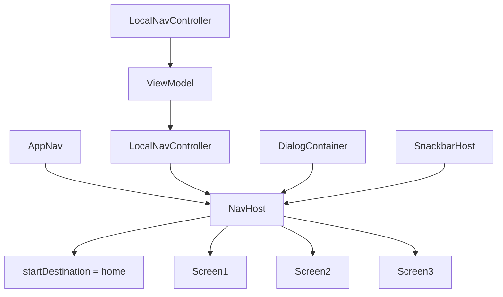
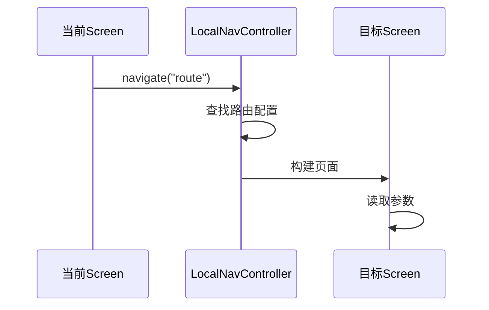
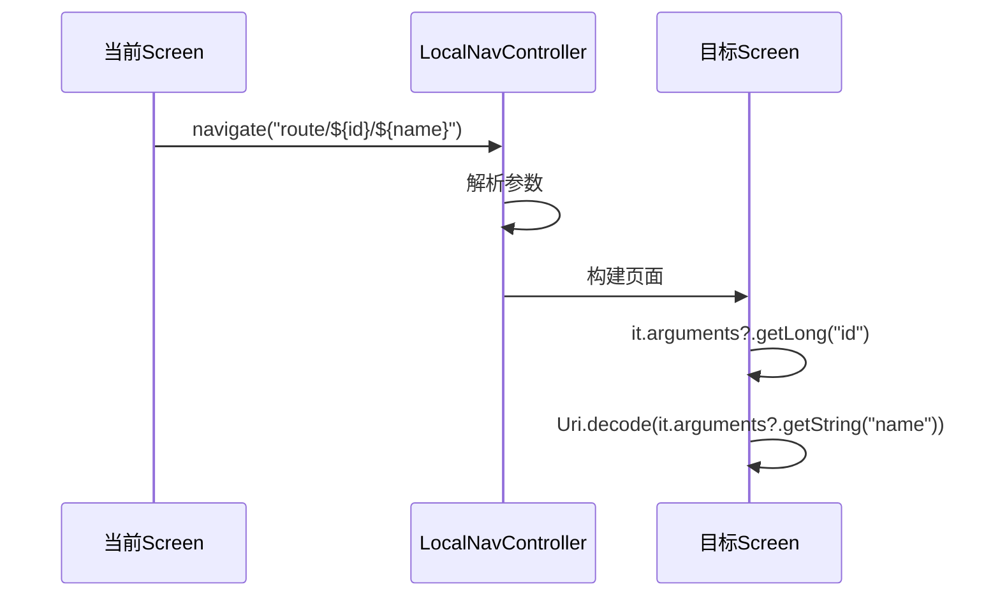
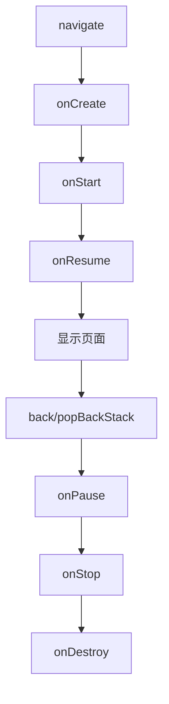
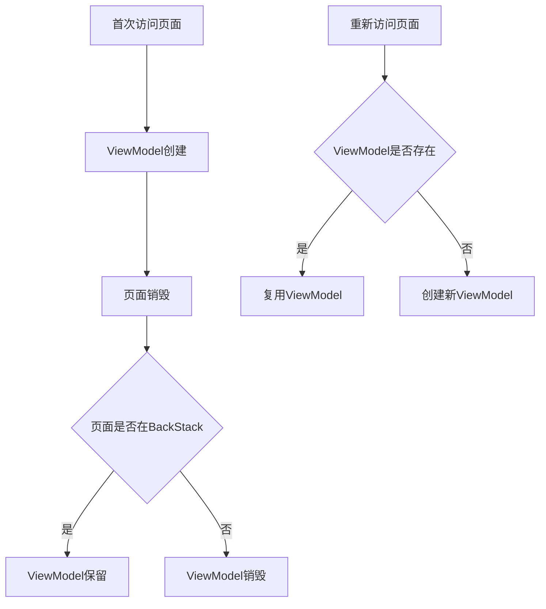
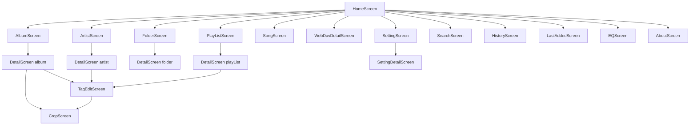

# 第六部分：Navigation

## Compose Navigation 架构



---

## 导航配置

### 路由定义

```kotlin
const val RouteHome = "home"
const val RouteSetting = "setting"
const val RouteSettingDetail = "setting_detail"
const val RouteSongChoose = "song_choose"
const val RouteAbout = "about"
const val RouteCustomSort = "custom_sort"
const val RouteLastAdded = "last_added"
const val RouteHistory = "history"
const val RouteSearch = "search"
const val RouteTagEdit = "tag_edit"
const val RouteCustomCoverCrop = "custom_cover_crop"
const val RouteTagEditCrop = "tag_edit_crop"
const val RouteEq = "eq"
const val RouteSupport = "support"
```

### 页面路由表

| 路由 | 页面 | 参数 |
|------|------|------|
| `home` | HomeScreen | 无 |
| `setting` | SettingScreen | 无 |
| `setting_detail/{category}` | SettingDetailScreen | category: String |
| `song_choose/{id}/{name}` | SongChooserScreen | id: Long, name: String |
| `about` | AboutScreen | 无 |
| `custom_sort/{id}` | CustomSortScreen | id: Long |
| `last_added` | LastAddedScreen | 无 |
| `history` | HistoryScreen | 无 |
| `search` | SearchScreen | 无 |
| `tag_edit` | TagEditScreen | 无 |
| `custom_cover_crop/{id}/{type}` | CropScreen | id: Long, type: Int |
| `tag_edit_crop/{uri}` | CropScreen | uri: String |
| `eq` | EQScreen | 无 |
| `support` | SupportScreen | 无 |

### 类型安全路由

#### DetailScreenRoute

```kotlin
@Serializable
data class DetailScreenRoute(
    val album: Album? = null,
    val artist: Artist? = null,
    val genre: Genre? = null,
    val playList: PlayList? = null,
    val folder: Folder? = null
)
```

**用途**: 使用单个路由处理多种详情页面，通过 `findNotNull()` 确定具体类型

#### WebDav / Smb 路由

```kotlin
composable<WebDav>(...) {
    val webDav = it.toRoute<WebDav>()
    WebDavDetailScreen(webDav)
}

composable<Smb>(...) {
    val smb = it.toRoute<Smb>()
    SmbDetailScreen(smb)
}
```

**用途**: 直接使用实体类作为路由参数，自动序列化/反序列化

---

## 页面跳转流程

### 标准跳转



### 带参数跳转



### 类型安全跳转

```kotlin
// 跳转
navController.navigate(DetailScreenRoute(album = album))

// 接收
val route = it.toRoute<DetailScreenRoute>()
val model = route.findNotNull()
DetailScreen(model)
```

---

## 页面生命周期

### Compose Navigation 生命周期



### ViewModel 生命周期



### 状态管理

**播放状态**:
```kotlin
val playbackUiState: StateFlow<PlaybackUiState> =
    MusicStateSource.playbackUiState
        .debounce(200)
        .distinctUntilChanged()
        .stateIn(viewModelScope, SharingStarted.Eagerly, ...)
```

**特点**:
- 使用 `MusicStateSource` 单例管理全局播放状态
- 所有页面共享同一状态
- 使用 `debounce` 和 `distinctUntilChanged` 减少不必要的刷新

---

## 导航组件

### LocalNavController

```kotlin
object LocalNavController {
    val current = compositionLocalOf<NavHostController> {
        error("NavController not provided")
    }
}
```

**用途**: 通过 CompositionLocal 在任意Composable中获取导航控制器

### MessageNotifier

```kotlin
object MessageNotifier {
    private val messages = MutableSharedFlow<String>()
    
    suspend fun show(message: String) {
        messages.emit(message)
    }
    
    val messages: SharedFlow<String> = messages.asSharedFlow()
}
```

**用途**: 全局消息通知，通过Snackbar显示

### SnackbarProvider

**集成方式**:
```kotlin
LaunchedEffect(Unit) {
    MessageNotifier.messages.collect {
        snackBarHostState.currentSnackbarData?.dismiss()
        snackBarHostState.showSnackbar(it)
    }
}
```

---

## 过渡动画

### 默认过渡

```kotlin
private fun NavGraphBuilder.normalAnimatedScreen(...) {
    composable(
        enterTransition = enterTransition(),
        exitTransition = exitTransition(),
        popEnterTransition = popEnterTransition(),
        popExitTransition = popExitTransition(),
        ...
    )
}
```

### 自定义过渡

```kotlin
composable<DetailScreenRoute>(
    enterTransition = enterTransition(),
    exitTransition = exitTransition(),
    ...
)
```

---

## DeepLink

### 播放页面DeepLink

```kotlin
val playingScreenDeepLink = "aplayer://playingScreen".toUri()
```

**用途**: 从外部打开播放页面

---

## 导航流程图



---

## 潜在问题

### 1. 路由参数安全性

**问题**: 部分路由使用字符串拼接传递参数，容易出错

**建议**: 使用类型安全路由（已部分实现）

### 2. 页面状态恢复

**问题**: 部分页面重新进入时状态丢失

**建议**: 使用 `SavedStateHandle` 保存状态

### 3. 导航栈管理

**问题**: 深层导航时返回路径不够直观

**建议**: 考虑使用 `popUpTo` 和 `saveState`

---

## 扩展建议

### 添加新页面步骤

1. **定义路由常量**
2. **创建Screen组件**
3. **创建ViewModel（如需要）**
4. **在AppNav中注册路由**
5. **添加过渡动画**

### 示例

```kotlin
// 1. 定义路由
const val RouteOnlineMusic = "online_music"

// 2. 创建Screen
@Composable
fun OnlineMusicScreen() {
    // ...
}

// 3. 在AppNav中注册
normalAnimatedScreen(RouteOnlineMusic) {
    OnlineMusicScreen()
}
```

---

## 总结

APlayer使用标准的Compose Navigation架构，支持：
- 类型安全路由（部分页面）
- 自定义过渡动画
- 全局状态管理
- 消息通知系统

扩展新页面只需遵循现有模式，无需修改核心导航逻辑。