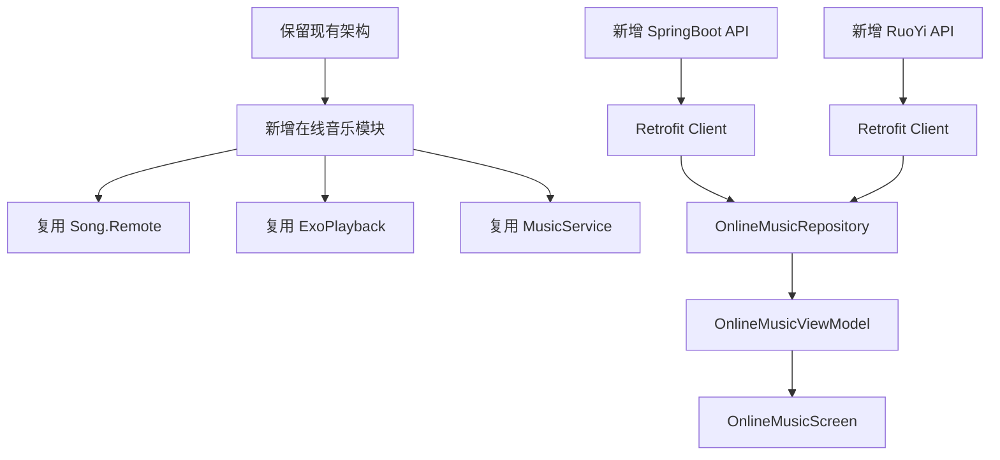
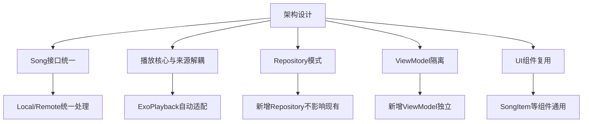

# 第十部分：扩展能力 & 第十三部分：二次开发建议

## 目标

保留本地播放功能，增加在线播放支持：
- SpringBoot后台
- RuoYi后台
- 最小修改现有代码

---

## 扩展能力分析

### 新增在线音乐

**需要修改的地方**:

| 文件 | 修改内容 |
|------|----------|
| `request/` | 新增在线音乐API客户端 |
| `repo/` | 新增 `OnlineMusicRepository` |
| `viewmodel/` | 新增 `OnlineMusicViewModel` |
| `ui/screen/` | 新增 `OnlineMusicScreen` |
| `ui/nav/AppNav.kt` | 注册新路由 |

**不需要修改的地方**:

| 文件 | 原因 |
|------|------|
| `Song.kt` | `Song.Remote` 已支持远程URL |
| `ExoPlayback.kt` | HTTP数据源已支持 |
| `MusicService.kt` | 播放逻辑与来源无关 |
| `Notify.kt` | 通知栏与来源无关 |
| `MediaSessionUpdater.kt` | 系统交互与来源无关 |

### 新增网络电台

**需要修改的地方**:

| 文件 | 修改内容 |
|------|----------|
| `data/model/audio/` | 新增 `Radio` 模型 |
| `repo/` | 新增 `RadioRepository` |
| `viewmodel/` | 新增 `RadioViewModel` |
| `ui/screen/` | 新增 `RadioScreen` |

**不需要修改的地方**:
- 播放核心组件（电台也是音频流）

### 新增 Podcast

**需要修改的地方**:

| 文件 | 修改内容 |
|------|----------|
| `data/model/audio/` | 新增 `Podcast` 模型 |
| `repo/` | 新增 `PodcastRepository` |
| `viewmodel/` | 新增 `PodcastViewModel` |
| `ui/screen/` | 新增 `PodcastScreen` |

**不需要修改的地方**:
- 播放核心组件

### 新增有声书

**需要修改的地方**:

| 文件 | 修改内容 |
|------|----------|
| `data/model/audio/` | 新增 `AudioBook` 模型 |
| `repo/` | 新增 `AudioBookRepository` |
| `viewmodel/` | 新增 `AudioBookViewModel` |
| `ui/screen/` | 新增 `AudioBookScreen` |

**不需要修改的地方**:
- 播放核心组件

### 新增 NAS

**需要修改的地方**:

| 文件 | 修改内容 |
|------|----------|
| `data/model/audio/` | 可能需要新模型 |
| `data/db/room/entity/` | 新增 NAS配置实体 |
| `data/db/room/dao/` | 新增 NAS DAO |
| `repo/` | 新增 `NasRepository` |
| `viewmodel/` | 新增 `NasViewModel` |
| `ui/screen/` | 新增 `NasScreen` |

**不需要修改的地方**:
- 播放核心组件（NAS也是远程文件）

---

## 最小修改方案

### 方案概述



### 新增文件清单

#### 1. API层

**`request/online/OnlineClient.kt`**

```kotlin
interface OnlineClient {
    @GET("api/songs")
    suspend fun getSongs(
        @Query("page") page: Int,
        @Query("size") size: Int
    ): OnlineMusicResponse

    @GET("api/songs/{id}")
    suspend fun getSong(@Path("id") id: Long): OnlineSong

    @GET("api/albums")
    suspend fun getAlbums(
        @Query("page") page: Int,
        @Query("size") size: Int
    ): OnlineAlbumResponse

    @GET("api/artists")
    suspend fun getArtists(
        @Query("page") page: Int,
        @Query("size") size: Int
    ): OnlineArtistResponse

    @GET("api/search")
    suspend fun search(
        @Query("keyword") keyword: String,
        @Query("type") type: String
    ): SearchResponse
}
```

**`request/online/OnlineModel.kt`**

```kotlin
data class OnlineMusicResponse(
    val code: Int,
    val data: List<OnlineSong>,
    val total: Long
)

data class OnlineSong(
    val id: Long,
    val title: String,
    val album: String,
    val artist: String,
    val duration: Long,
    val url: String,
    val coverUrl: String
)

data class OnlineAlbumResponse(...)
data class OnlineArtistResponse(...)
data class SearchResponse(...)
```

#### 2. Repository层

**`repo/OnlineMusicRepository.kt`**

```kotlin
interface OnlineMusicRepository {
    suspend fun getSongs(page: Int, size: Int): List<Song.Remote>
    suspend fun getSong(id: Long): Song.Remote?
    suspend fun getAlbums(page: Int, size: Int): List<Album>
    suspend fun getArtists(page: Int, size: Int): List<Artist>
    suspend fun search(keyword: String): List<Song.Remote>
}

class OnlineMusicRepoImpl @Inject constructor(
    private val onlineClient: OnlineClient,
    private val settingPrefs: SettingPrefs
) : OnlineMusicRepository {

    override suspend fun getSongs(page: Int, size: Int): List<Song.Remote> {
        val response = onlineClient.getSongs(page, size)
        return response.data.map { it.toSongRemote() }
    }

    override suspend fun getSong(id: Long): Song.Remote? {
        return onlineClient.getSong(id).toSongRemote()
    }

    override suspend fun search(keyword: String): List<Song.Remote> {
        val response = onlineClient.search(keyword, "song")
        return response.data.map { it.toSongRemote() }
    }
}

private fun OnlineSong.toSongRemote(): Song.Remote {
    return Song.Remote(
        title = title,
        album = album,
        artist = artist,
        duration = duration,
        data = url,
        size = 0L,
        year = "",
        genre = "",
        track = null,
        dateModified = System.currentTimeMillis(),
        account = "",
        pwd = ""
    )
}
```

#### 3. ViewModel层

**`viewmodel/OnlineMusicViewModel.kt`**

```kotlin
@HiltViewModel
class OnlineMusicViewModel @Inject constructor(
    private val onlineMusicRepository: OnlineMusicRepository,
    private val settingPrefs: SettingPrefs
) : ViewModel() {

    private val _songs = MutableStateFlow<List<Song>>(emptyList())
    val songs: StateFlow<List<Song>> = _songs.asStateFlow()

    private val _albums = MutableStateFlow<List<Album>>(emptyList())
    val albums: StateFlow<List<Album>> = _albums.asStateFlow()

    private val _loading = MutableStateFlow(false)
    val loading: StateFlow<Boolean> = _loading.asStateFlow()

    fun loadSongs(page: Int = 0, size: Int = 20) = viewModelScope.launch {
        _loading.value = true
        try {
            val result = onlineMusicRepository.getSongs(page, size)
            if (page == 0) {
                _songs.value = result
            } else {
                _songs.value = _songs.value + result
            }
        } catch (e: Exception) {
            MessageNotifier.show(e.message ?: "加载失败")
        } finally {
            _loading.value = false
        }
    }

    fun loadAlbums(page: Int = 0, size: Int = 20) = viewModelScope.launch {
        _loading.value = true
        try {
            val result = onlineMusicRepository.getAlbums(page, size)
            if (page == 0) {
                _albums.value = result
            } else {
                _albums.value = _albums.value + result
            }
        } catch (e: Exception) {
            MessageNotifier.show(e.message ?: "加载失败")
        } finally {
            _loading.value = false
        }
    }

    fun playSongs(songs: List<Song>, position: Int) {
        MusicServiceRemote.setPlayQueue(songs, Intent().apply {
            putExtra(MusicService.EXTRA_COMMAND, Command.PLAY_AT)
            putExtra(MusicService.EXTRA_POSITION, position)
        })
    }

    fun search(keyword: String) = viewModelScope.launch {
        _loading.value = true
        try {
            val result = onlineMusicRepository.search(keyword)
            _songs.value = result
        } catch (e: Exception) {
            MessageNotifier.show(e.message ?: "搜索失败")
        } finally {
            _loading.value = false
        }
    }
}
```

#### 4. UI层

**`ui/screen/online/OnlineMusicScreen.kt`**

```kotlin
@Composable
fun OnlineMusicScreen() {
    val viewModel = hiltViewModel<OnlineMusicViewModel>()
    val songs by viewModel.songs.collectAsState()
    val loading by viewModel.loading.collectAsState()
    
    Scaffold(
        topBar = {
            CommonAppBar(
                title = stringResource(R.string.online_music),
                onBackPressed = { LocalNavController.current.popBackStack() }
            )
        }
    ) { padding ->
        Box(modifier = Modifier.padding(padding)) {
            if (loading) {
                LoadingDialog()
            }
            
            LazyColumn {
                items(songs) { song ->
                    SongItem(song = song) {
                        viewModel.playSongs(songs, songs.indexOf(song))
                    }
                }
            }
        }
    }
    
    LaunchedEffect(Unit) {
        viewModel.loadSongs()
    }
}
```

#### 5. Navigation层

**修改 `ui/nav/AppNav.kt`**

```kotlin
// 添加路由常量
const val RouteOnlineMusic = "online_music"

// 注册路由
normalAnimatedScreen(RouteOnlineMusic) {
    OnlineMusicScreen()
}
```

#### 6. DI层

**修改 `di/RepositoryModule.kt`**

```kotlin
@Module
@InstallIn(SingletonComponent::class)
object RepositoryModule {

    @Provides
    fun provideOnlineMusicRepository(
        onlineClient: OnlineClient,
        settingPrefs: SettingPrefs
    ): OnlineMusicRepository = OnlineMusicRepoImpl(onlineClient, settingPrefs)
}
```

**修改 `di/NetworkModule.kt`**

```kotlin
@Module
@InstallIn(SingletonComponent::class)
object NetworkModule {

    @Provides
    fun provideOnlineClient(): OnlineClient {
        return Retrofit.Builder()
            .baseUrl(BuildConfig.BASE_URL)
            .addConverterFactory(KotlinSerializationConverterFactory())
            .client(OkHttpClient.Builder().build())
            .build()
            .create(OnlineClient::class.java)
    }
}
```

#### 7. BuildConfig

**修改 `build.gradle.kts`**

```kotlin
buildConfigField(
    "String",
    "BASE_URL",
    "\"${properties.getProperty("BASE_URL")}\""
)
```

**添加到 `local.properties`**

```
BASE_URL=http://your-server:8080/
```

---

## RuoYi后台适配

### RuoYi API特点

| 特点 | 说明 |
|------|------|
| 返回格式 | `{"code": 200, "msg": "success", "data": {...}}` |
| 分页 | `{"pageNum": 1, "pageSize": 20, "total": 100}` |
| 认证 | JWT Token |

### 适配方案

**修改 `OnlineModel.kt`**

```kotlin
@Serializable
data class RuoYiResponse<T>(
    val code: Int,
    val msg: String,
    val data: T
)

@Serializable
data class RuoYiPageResponse<T>(
    val code: Int,
    val msg: String,
    val data: RuoYiPageData<T>
)

@Serializable
data class RuoYiPageData<T>(
    val rows: List<T>,
    val total: Long,
    val pageNum: Int,
    val pageSize: Int
)
```

**修改 `OnlineClient.kt`**

```kotlin
interface OnlineClient {
    @GET("system/song/list")
    suspend fun getSongs(
        @Query("pageNum") page: Int,
        @Query("pageSize") size: Int
    ): RuoYiPageResponse<OnlineSong>
}
```

**修改 `OnlineMusicRepoImpl.kt`**

```kotlin
override suspend fun getSongs(page: Int, size: Int): List<Song.Remote> {
    val response = onlineClient.getSongs(page, size)
    return response.data.rows.map { it.toSongRemote() }
}
```

**添加认证拦截器**

```kotlin
@Module
@InstallIn(SingletonComponent::class)
object NetworkModule {

    @Provides
    fun provideOnlineClient(settingPrefs: SettingPrefs): OnlineClient {
        val client = OkHttpClient.Builder()
            .addInterceptor { chain ->
                val token = settingPrefs.onlineToken
                val request = chain.request()
                    .newBuilder()
                    .addHeader("Authorization", "Bearer $token")
                    .build()
                chain.proceed(request)
            }
            .build()
            
        return Retrofit.Builder()
            .baseUrl(BuildConfig.BASE_URL)
            .addConverterFactory(KotlinSerializationConverterFactory())
            .client(client)
            .build()
            .create(OnlineClient::class.java)
    }
}
```

---

## 需要修改的现有文件

### 1. `HomeScreen.kt`

**添加在线音乐入口**:

```kotlin
// 在首页Tab列表中添加
if (settingPrefs.showOnlineMusic) {
    Tab(
        text = { Text(stringResource(R.string.online_music)) },
        selected = currentTab == TabType.ONLINE_MUSIC,
        onClick = {
            currentTab = TabType.ONLINE_MUSIC
            navController.navigate(RouteOnlineMusic)
        }
    )
}
```

### 2. `SettingPrefs.kt`

**添加在线音乐相关配置**:

```kotlin
var showOnlineMusic by booleanPref("show_online_music", true)
var onlineToken by stringPref("online_token", "")
var onlineServerUrl by stringPref("online_server_url", "")
```

### 3. `SettingScreen.kt`

**添加在线音乐设置**:

```kotlin
// 在设置页面添加在线音乐配置项
Preference(
    title = stringResource(R.string.online_music_server),
    summary = settingPrefs.onlineServerUrl,
    onClick = {
        // 跳转到服务器配置页面
    }
)
```

---

## 不需要修改的文件

| 文件 | 原因 |
|------|------|
| `Song.kt` | `Song.Remote` 已支持远程URL |
| `ExoPlayback.kt` | HTTP数据源自动处理 |
| `MusicService.kt` | 播放逻辑与来源无关 |
| `Playback.kt` | 播放接口不变 |
| `Notify.kt` | 通知栏与来源无关 |
| `MediaSessionUpdater.kt` | 系统交互与来源无关 |
| `AudioFocusManager.kt` | 音频焦点与来源无关 |
| `AppWidgetUpdater.kt` | Widget与来源无关 |
| `LyricManager.kt` | 歌词搜索与来源无关 |
| `PlayQueueStore.kt` | 队列存储与来源无关 |
| `PlayListRepository.kt` | 歌单管理与来源无关 |
| `HistoryRepository.kt` | 历史记录与来源无关 |

---

## 架构优势

### 为什么可以最小修改



### 核心设计原则

1. **单一职责**: 每个组件只负责一个功能
2. **依赖倒置**: 高层模块依赖抽象，不依赖具体实现
3. **开闭原则**: 对扩展开放，对修改关闭
4. **里氏替换**: `Song.Remote` 可以替换 `Song.Local`

---

## 完整修改清单

### 新增文件

| 文件 | 说明 |
|------|------|
| `request/online/OnlineClient.kt` | Retrofit接口 |
| `request/online/OnlineModel.kt` | 数据模型 |
| `repo/OnlineMusicRepository.kt` | 数据仓库 |
| `viewmodel/OnlineMusicViewModel.kt` | 视图模型 |
| `ui/screen/online/OnlineMusicScreen.kt` | 页面 |

### 修改文件

| 文件 | 修改内容 |
|------|----------|
| `ui/nav/AppNav.kt` | 注册路由 |
| `di/RepositoryModule.kt` | 注入Repository |
| `di/NetworkModule.kt` | 创建API客户端 |
| `HomeScreen.kt` | 添加入口 |
| `SettingPrefs.kt` | 添加配置项 |
| `build.gradle.kts` | 添加BuildConfig |

### 零修改文件

- 播放核心: `MusicService`, `ExoPlayback`, `Playback`
- 通知栏: `Notify`, `NotifyImpl`, `NotifyImpl24`
- 系统交互: `MediaSessionUpdater`, `AudioFocusManager`
- 数据模型: `Song`, `Album`, `Artist`
- 其他Repository: `SongRepository`, `PlayListRepository` 等

---

## 总结

APlayer的架构设计良好，支持最小修改扩展在线音乐功能。核心播放逻辑与音频来源完全解耦，新增在线音乐只需：

1. **新增API层**: Retrofit接口和数据模型
2. **新增Repository**: 数据访问层
3. **新增ViewModel**: 业务逻辑层
4. **新增Screen**: UI展示层
5. **注册导航**: 添加路由
6. **配置注入**: Hilt依赖注入

**无需修改任何核心播放代码**，这是一个优秀架构的典型特征。