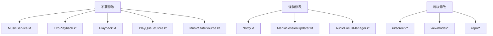
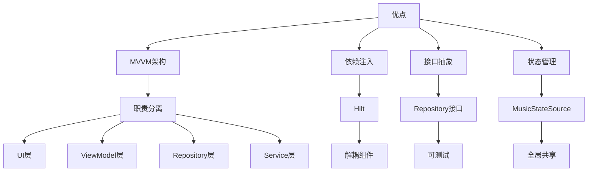

# 第十一部分：升级策略 & 第十二部分：代码质量

## 升级策略

### 同步官方版本时的冲突风险

#### 高冲突风险文件

| 文件 | 风险原因 | 建议 |
|------|----------|------|
| `MusicService.kt` | 核心播放逻辑，官方频繁修改 | 尽量不修改，或继承扩展 |
| `ExoPlayback.kt` | 播放器核心，官方频繁修改 | 尽量不修改 |
| `Song.kt` | 数据模型，官方可能修改结构 | 使用扩展属性代替修改 |
| `Playback.kt` | 播放接口，官方可能修改 | 不修改接口定义 |
| `Notify.kt` | 通知栏，官方可能修改样式 | 不修改核心逻辑 |
| `MediaSessionUpdater.kt` | 系统交互，官方可能修改 | 不修改 |

#### 低冲突风险文件

| 文件 | 原因 |
|------|------|
| `ui/screen/*` | UI层相对独立 |
| `viewmodel/*` | 业务逻辑相对独立 |
| `repo/OnlineMusicRepository.kt` | 新增文件，官方没有 |
| `request/online/*` | 新增文件，官方没有 |
| `data/db/room/entity/*` | 数据库结构相对稳定 |

### 最好不要修改的文件

#### 核心播放层



### 推荐的扩展方式

#### 1. 继承扩展

```kotlin
// 创建子类扩展功能，不修改父类
class CustomMusicService : MusicService() {
    // 添加自定义逻辑
}
```

**适用场景**: 需要重写部分方法

#### 2. 组合扩展

```kotlin
// 通过组合方式添加功能
class OnlineMusicManager(
    private val musicService: MusicService
) {
    fun playOnlineSong(song: Song.Remote) {
        // 使用musicService的现有方法
    }
}
```

**适用场景**: 添加新功能，不修改现有代码

#### 3. 装饰器模式

```kotlin
// 通过装饰器包装现有组件
class EnhancedPlayback(private val delegate: Playback) : Playback by delegate {
    override fun start() {
        // 额外逻辑
        delegate.start()
        // 额外逻辑
    }
}
```

**适用场景**: 需要在现有方法前后添加逻辑

#### 4. 插件化扩展

```kotlin
// 通过接口和注入实现插件化
interface MusicSourcePlugin {
    fun getSongs(): List<Song>
}

@Module
@InstallIn(SingletonComponent::class)
object OnlineMusicPluginModule {
    @Provides
    fun provideOnlineMusicPlugin(): MusicSourcePlugin = OnlineMusicPlugin()
}
```

**适用场景**: 需要动态添加数据源

#### 5. 新增模块扩展

```kotlin
// 创建新模块，不依赖现有代码修改
// feature_online_music/
//   src/main/java/
//     com/example/onlinemusic/
//       OnlineMusicModule.kt
```

**适用场景**: 大型功能扩展

---

## 代码质量分析

### 优点

#### 1. 架构清晰



#### 2. 代码规范

- 使用 Kotlin 协程处理异步
- 使用 Flow 进行状态流管理
- 使用 Hilt 进行依赖注入
- 使用 Room 进行数据库操作
- 使用 Retrofit 进行网络请求

#### 3. 功能完整

- 本地音乐播放
- WebDAV远程播放
- SMB远程播放
- 歌词搜索与显示
- 桌面歌词
- 均衡器
- 睡眠定时
- 通知栏控制
- 锁屏控制
- 桌面部件

#### 4. 用户体验

- Material3 设计风格
- 深色模式支持
- 自定义主题色
- 流畅动画
- 响应式布局

### 缺点

#### 1. 代码重复

**问题**: 多个Repository有相似的代码结构

**示例**:
```kotlin
// AlbumRepository, ArtistRepository, GenreRepository 有相似的查询逻辑
// 可以抽取为通用方法
```

**建议**: 使用泛型和委托减少重复

#### 2. 错误处理不完善

**问题**: 部分网络请求和数据库操作缺少错误处理

**示例**:
```kotlin
suspend fun getSongs() {
    // 缺少 try-catch
    val response = api.getSongs()
    return response.data
}
```

**建议**: 统一错误处理机制

#### 3. 测试覆盖率低

**问题**: 缺少单元测试和集成测试

**建议**: 
- 为Repository层添加单元测试
- 为ViewModel层添加测试
- 使用MockK进行依赖模拟

#### 4. 文档缺失

**问题**: 代码缺少注释和文档

**建议**: 添加KDoc注释

### 架构问题

#### 1. 上帝类问题

**问题**: `MusicService` 包含太多职责

**职责清单**:
- 播放控制
- 通知栏管理
- MediaSession管理
- 音频焦点管理
- 播放历史管理
- 收藏状态管理
- 播放队列管理
- 歌词管理
- 部件更新
- 进度保存
- 事件接收

**建议**: 拆分为多个服务或Manager类

#### 2. 状态管理分散

**问题**: 播放状态在多个地方管理

**当前状态**:
- `MusicStateSource` - 全局状态
- `PlaybackUiState` - 播放UI状态
- `PlaybackProgressSaver` - 进度保存
- `PlaybackFavoriteState` - 收藏状态

**建议**: 统一状态管理

#### 3. 广播通信过多

**问题**: 使用广播进行组件间通信，耦合度高

**当前方式**:
```kotlin
// 发送广播
Util.sendLocalBroadcast(Intent(MusicService.ACTION_CMD))

// 接收广播
registerLocalReceiver(controlReceiver, IntentFilter(ACTION_CMD))
```

**建议**: 使用Flow或LiveData进行组件间通信

### 性能问题

#### 1. 数据库查询性能

**问题**: PlayList使用JSON存储歌曲ID，查询效率低

**建议**: 使用关联表

#### 2. 列表渲染性能

**问题**: 大列表（如全部歌曲）渲染卡顿

**建议**: 
- 使用分页加载
- 使用虚拟列表
- 优化Item布局

#### 3. 内存泄漏风险

**问题**: 
- Context引用可能导致泄漏
- 协程未正确取消
- 广播接收器未正确注销

**建议**: 
- 使用Application Context
- 在onDestroy中取消协程
- 使用LifecycleOwner管理生命周期

### 可维护性

#### 1. 模块划分

**现状**: 模块划分合理，但部分模块过大

**建议**: 进一步拆分大型模块

#### 2. 命名规范

**现状**: 基本遵循规范，但部分命名不够清晰

**建议**: 统一命名规范

#### 3. 代码组织

**现状**: 文件组织合理，但部分文件过长

**建议**: 拆分过长的文件

---

## 代码优化建议

### 短期优化（1-2周）

| 优化项 | 优先级 | 说明 |
|--------|--------|------|
| 添加错误处理 | 高 | 统一网络和数据库错误处理 |
| 添加单元测试 | 高 | 为核心模块添加测试 |
| 优化列表渲染 | 中 | 添加分页和虚拟列表 |
| 添加KDoc注释 | 中 | 提高代码可读性 |

### 中期优化（1-2月）

| 优化项 | 优先级 | 说明 |
|--------|--------|------|
| 拆分MusicService | 高 | 拆分为多个Manager类 |
| 统一状态管理 | 高 | 使用单一状态源 |
| 替换广播通信 | 中 | 使用Flow进行组件通信 |
| 数据库优化 | 中 | 使用关联表替代JSON |

### 长期优化（2-3月）

| 优化项 | 优先级 | 说明 |
|--------|--------|------|
| 模块化重构 | 高 | 使用Dynamic Feature模块 |
| 架构升级 | 中 | 考虑使用MVI架构 |
| 性能监控 | 中 | 添加性能监控和分析 |
| A/B测试框架 | 低 | 添加实验框架 |

---

## 总结

### 升级策略要点

1. **最小修改**: 优先新增文件，其次修改配置文件，最后修改核心代码
2. **接口隔离**: 通过接口与官方代码解耦
3. **插件化**: 使用依赖注入实现功能插件化
4. **分支管理**: 使用独立分支管理自定义修改

### 代码质量改进方向

1. **架构优化**: 拆分上帝类，统一状态管理
2. **性能优化**: 优化数据库查询，提升列表渲染性能
3. **测试完善**: 添加单元测试和集成测试
4. **文档完善**: 添加注释和文档