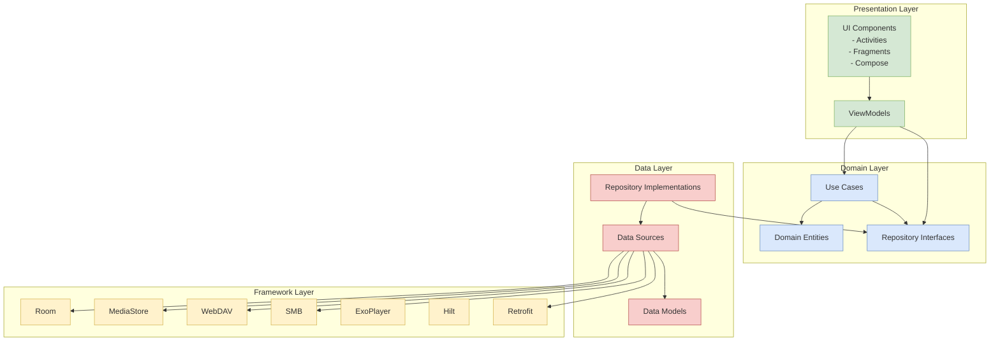
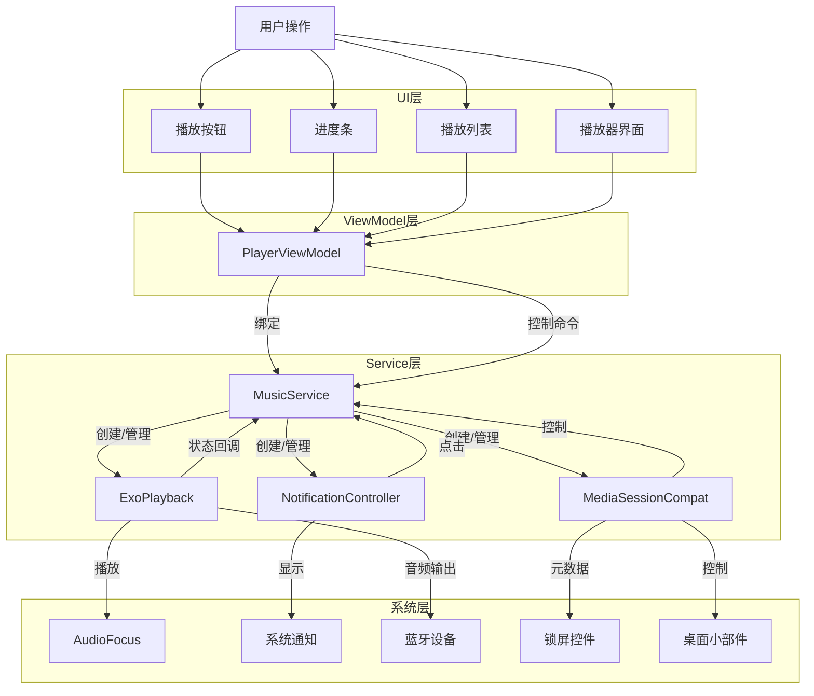
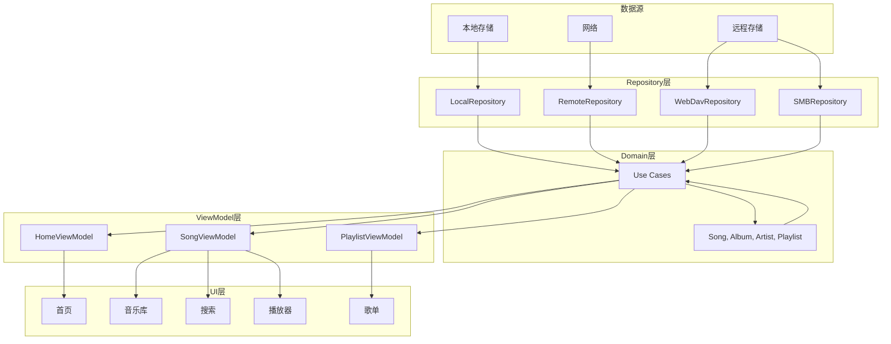
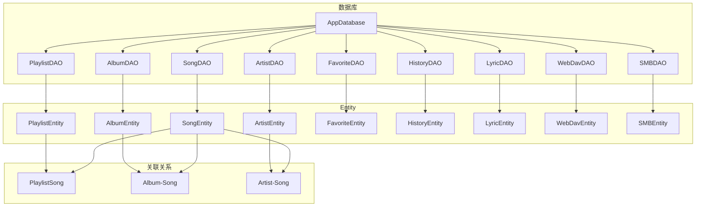
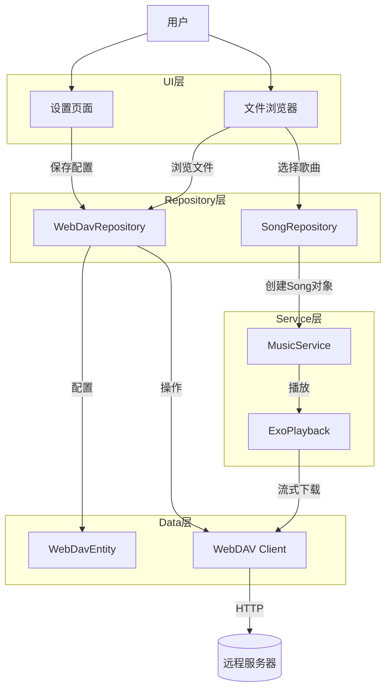
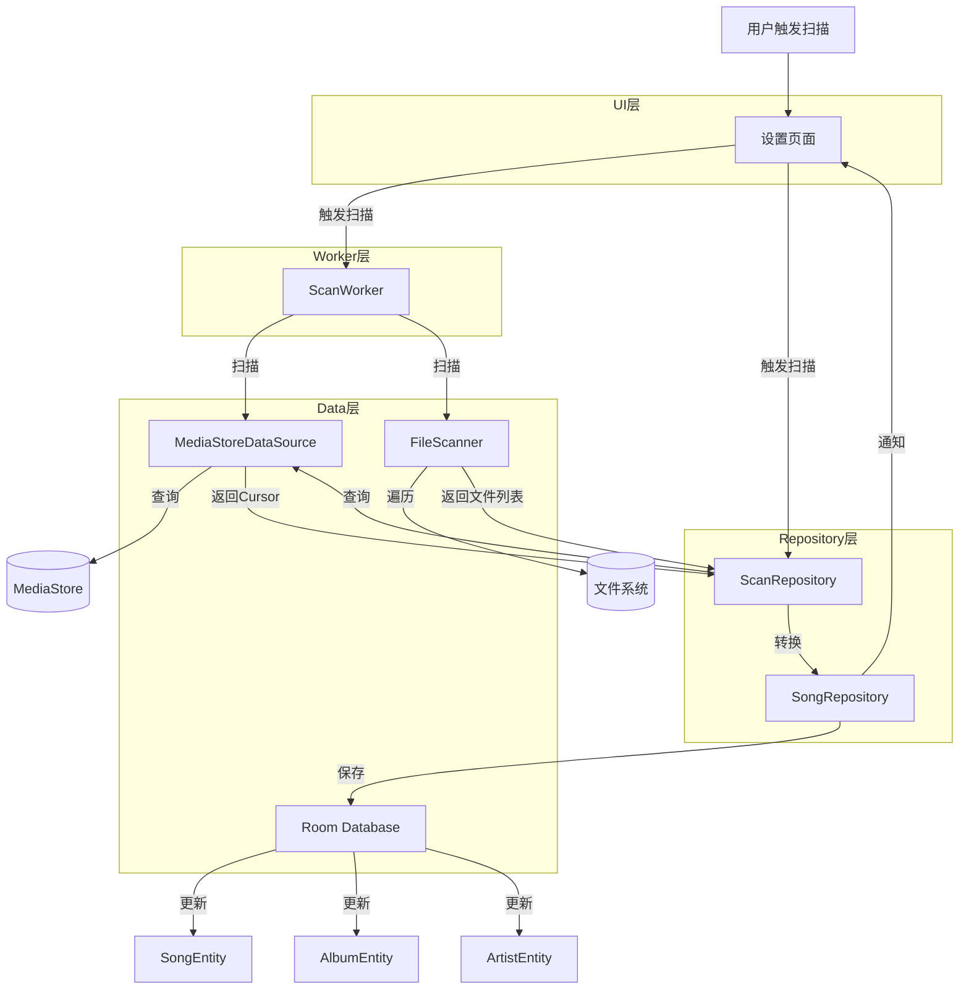
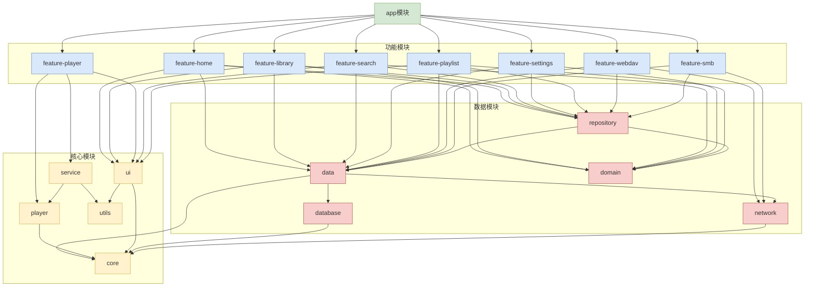

# 完整架构图

## 1. 项目整体架构

```mermaid
graph TB
    subgraph Android系统层
        Android[Android OS]
        MediaStore[MediaStore]
        AudioFocus[AudioFocusManager]
        NotificationManager[NotificationManager]
        Bluetooth[BluetoothManager]
        SystemUI[SystemUI/LockScreen]
    end
    
    subgraph APlayer应用
        subgraph UI层
            Compose[Jetpack Compose]
            Activities[Activities]
            Fragments[Fragments]
            Views[Custom Views]
        end
        
        subgraph ViewModel层
            HomeVM[HomeViewModel]
            SongVM[SongViewModel]
            PlaylistVM[PlaylistViewModel]
            SearchVM[SearchViewModel]
            SettingVM[SettingViewModel]
        end
        
        subgraph Repository层
            SongRepo[SongRepository]
            PlaylistRepo[PlaylistRepository]
            WebDavRepo[WebDavRepository]
            SMBRepo[SMBRepository]
            FavoriteRepo[FavoriteRepository]
            HistoryRepo[HistoryRepository]
            LyricRepo[LyricRepository]
        end
        
        subgraph Data层
            subgraph 本地数据源
                Room[Room Database]
                MediaStoreDataSource[MediaStore DataSource]
                FileDataSource[File DataSource]
            end
            
            subgraph 远程数据源
                WebDavClient[WebDAV Client]
                SMB[SMB Client]
                Retrofit[Retrofit]
            end
        end
        
        subgraph Domain层
            UseCase[Use Cases]
            Models[Domain Models]
        end
        
        subgraph Service层
            MusicService[MusicService]
            Playback[ExoPlayback]
            MediaSession[MediaSession]
            Notification[NotificationManager]
            Widget[WidgetProvider]
            SleepTimer[SleepTimer]
        end
        
        subgraph 第三方库
            ExoPlayer[ExoPlayer/Media3]
            Hilt[Hilt DI]
            Glide[Glide]
            OkHttp[OkHttp]
            WebDavLib[WebDAV Library]
            SMBLib[SMB Library]
        end
    end
    
    UI --> ViewModel
    ViewModel --> Repository
    Repository --> Data
    Repository --> Domain
    ViewModel -.-> Service
    Service -.-> ExoPlayer
    Service -.-> MediaSession
    Service -.-> NotificationManager
    Service -.-> Android
    Data -.-> MediaStore
    Data -.-> Android
```

## 2. Clean Architecture 分层架构

```mermaid
graph TD
    subgraph Presentation层[Presentation Layer]
        UI[UI Components<br/>- Activities<br/>- Fragments<br/>- Compose]
        ViewModels[ViewModels]
    end
    
    subgraph Domain层[Domain Layer]
        UseCases[Use Cases]
        Entities[Domain Entities]
        RepositoryInterfaces[Repository Interfaces]
    end
    
    subgraph Data层[Data Layer]
        Repositories[Repository Implementations]
        DataSources[Data Sources]
        Models[Data Models]
    end
    
    subgraph Framework层[Framework Layer]
        Room[Room]
        MediaStore[MediaStore]
        WebDAV[WebDAV]
        SMB[SMB]
        ExoPlayer[ExoPlayer]
        Hilt[Hilt]
        Retrofit[Retrofit]
    end
    
    UI --> ViewModels
    ViewModels --> UseCases
    ViewModels --> RepositoryInterfaces
    UseCases --> RepositoryInterfaces
    UseCases --> Entities
    Repositories --> RepositoryInterfaces
    Repositories --> DataSources
    DataSources --> Models
    DataSources --> Room
    DataSources --> MediaStore
    DataSources --> WebDAV
    DataSources --> SMB
    DataSources --> Retrofit
    
    classDef presentation fill:#D5E8D4,stroke:#82B366
    classDef domain fill:#DAE8FC,stroke:#6C8EBF
    classDef data fill:#F8CECC,stroke:#B85450
    classDef framework fill:#FFF2CC,stroke:#D6B656
    
    class UI,ViewModels presentation
    class UseCases,Entities,RepositoryInterfaces domain
    class Repositories,DataSources,Models data
    class Room,MediaStore,WebDAV,SMB,ExoPlayer,Hilt,Retrofit framework
```

## 3. 播放控制架构

```mermaid
graph TD
    User[用户操作]
    
    subgraph UI层
        PlayButton[播放按钮]
        SeekBar[进度条]
        PlayList[播放列表]
        PlayerScreen[播放器界面]
    end
    
    subgraph ViewModel层
        PlayerVM[PlayerViewModel]
    end
    
    subgraph Service层
        MS[MusicService]
        MP[ExoPlayback]
        MediaSession[MediaSessionCompat]
        Notification[NotificationController]
    end
    
    subgraph 系统层
        AF[AudioFocus]
        NotificationManager[系统通知]
        Bluetooth[蓝牙设备]
        LockScreen[锁屏控件]
        Widget[桌面小部件]
    end
    
    User --> PlayButton
    User --> SeekBar
    User --> PlayList
    User --> PlayerScreen
    
    PlayButton --> PlayerVM
    SeekBar --> PlayerVM
    PlayList --> PlayerVM
    PlayerScreen --> PlayerVM
    
    PlayerVM -->|绑定| MS
    PlayerVM -->|控制命令| MS
    
    MS -->|创建/管理| MP
    MS -->|创建/管理| MediaSession
    MS -->|创建/管理| Notification
    
    MP -->|播放| AF
    MP -->|音频输出| Bluetooth
    MP -->|状态回调| MS
    
    MediaSession -->|控制| MS
    MediaSession -->|元数据| LockScreen
    MediaSession -->|控制| Widget
    
    Notification -->|显示| NotificationManager
    Notification -->|点击| MS
```

## 4. 数据流架构

```mermaid
graph TD
    subgraph 数据源
        Local[本地存储]
        Network[网络]
        Remote[远程存储]
    end
    
    subgraph Repository层
        LocalRepo[LocalRepository]
        RemoteRepo[RemoteRepository]
        WebDavRepo[WebDavRepository]
        SMBRepo[SMBRepository]
    end
    
    subgraph Domain层
        UseCases[Use Cases]
        Models[Song, Album, Artist, Playlist]
    end
    
    subgraph ViewModel层
        HomeVM[HomeViewModel]
        SongVM[SongViewModel]
        PlaylistVM[PlaylistViewModel]
    end
    
    subgraph UI层
        Home[首页]
        Library[音乐库]
        Search[搜索]
        Player[播放器]
        Playlist[歌单]
    end
    
    Local --> LocalRepo
    Network --> RemoteRepo
    Remote --> WebDavRepo
    Remote --> SMBRepo
    
    LocalRepo --> UseCases
    RemoteRepo --> UseCases
    WebDavRepo --> UseCases
    SMBRepo --> UseCases
    
    UseCases --> Models
    Models --> UseCases
    
    UseCases --> HomeVM
    UseCases --> SongVM
    UseCases --> PlaylistVM
    
    HomeVM --> Home
    SongVM --> Library
    SongVM --> Search
    SongVM --> Player
    PlaylistVM --> Playlist
```

## 5. 数据库与存储架构

```mermaid
graph TD
    subgraph 数据库
        AppDB[AppDatabase]
        SongDAO[SongDAO]
        AlbumDAO[AlbumDAO]
        ArtistDAO[ArtistDAO]
        PlaylistDAO[PlaylistDAO]
        FavoriteDAO[FavoriteDAO]
        HistoryDAO[HistoryDAO]
        LyricDAO[LyricDAO]
        WebDavDAO[WebDavDAO]
        SMBDAO[SMBDAO]
    end
    
    subgraph Entity
        SongEntity[SongEntity]
        AlbumEntity[AlbumEntity]
        ArtistEntity[ArtistEntity]
        PlaylistEntity[PlaylistEntity]
        FavoriteEntity[FavoriteEntity]
        HistoryEntity[HistoryEntity]
        LyricEntity[LyricEntity]
        WebDavEntity[WebDavEntity]
        SMBEntity[SMBEntity]
    end
    
    subgraph 关联关系
        PlaylistSong[PlaylistSong]
        AlbumSong[Album-Song]
        ArtistSong[Artist-Song]
    end
    
    AppDB --> SongDAO
    AppDB --> AlbumDAO
    AppDB --> ArtistDAO
    AppDB --> PlaylistDAO
    AppDB --> FavoriteDAO
    AppDB --> HistoryDAO
    AppDB --> LyricDAO
    AppDB --> WebDavDAO
    AppDB --> SMBDAO
    
    SongDAO --> SongEntity
    AlbumDAO --> AlbumEntity
    ArtistDAO --> ArtistEntity
    PlaylistDAO --> PlaylistEntity
    FavoriteDAO --> FavoriteEntity
    HistoryDAO --> HistoryEntity
    LyricDAO --> LyricEntity
    WebDavDAO --> WebDavEntity
    SMBDAO --> SMBEntity
    
    PlaylistEntity --> PlaylistSong
    SongEntity --> PlaylistSong
    AlbumEntity --> AlbumSong
    SongEntity --> AlbumSong
    ArtistEntity --> ArtistSong
    SongEntity --> ArtistSong
```

## 6. WebDAV 接入架构

```mermaid
graph TD
    User[用户]
    
    subgraph UI层
        Setting[设置页面]
        FileBrowser[文件浏览器]
    end
    
    subgraph Repository层
        WebDavRepo[WebDavRepository]
        SongRepo[SongRepository]
    end
    
    subgraph Data层
        WebDavClient[WebDAV Client]
        WebDavDB[WebDavEntity]
    end
    
    subgraph Service层
        MusicService[MusicService]
        ExoPlayback[ExoPlayback]
    end
    
    User --> Setting
    User --> FileBrowser
    
    Setting -->|保存配置| WebDavRepo
    FileBrowser -->|浏览文件| WebDavRepo
    
    WebDavRepo -->|配置| WebDavDB
    WebDavRepo -->|操作| WebDavClient
    
    WebDavClient -->|HTTP| RemoteServer[(远程服务器)]
    
    FileBrowser -->|选择歌曲| SongRepo
    SongRepo -->|创建Song对象| MusicService
    MusicService -->|播放| ExoPlayback
    ExoPlayback -->|流式下载| WebDavClient
```

## 7. 本地扫描流程架构

```mermaid
graph TD
    User[用户触发扫描]
    
    subgraph UI层
        Settings[设置页面]
    end
    
    subgraph Repository层
        ScanRepo[ScanRepository]
        SongRepo[SongRepository]
    end
    
    subgraph Data层
        MediaStoreDS[MediaStoreDataSource]
        FileScanner[FileScanner]
        RoomDB[Room Database]
    end
    
    subgraph Worker层
        ScanWorker[ScanWorker]
    end
    
    User --> Settings
    Settings -->|触发扫描| ScanWorker
    Settings -->|触发扫描| ScanRepo
    
    ScanWorker -->|扫描| MediaStoreDS
    ScanWorker -->|扫描| FileScanner
    ScanRepo -->|查询| MediaStoreDS
    
    MediaStoreDS -->|查询| AndroidMediaStore[(MediaStore)]
    FileScanner -->|遍历| FileSystem[(文件系统)]
    
    MediaStoreDS -->|返回Cursor| ScanRepo
    FileScanner -->|返回文件列表| ScanRepo
    
    ScanRepo -->|转换| SongRepo
    SongRepo -->|保存| RoomDB
    
    RoomDB -->|更新| SongEntity
    RoomDB -->|更新| AlbumEntity
    RoomDB -->|更新| ArtistEntity
    
    SongRepo -->|通知| Settings
```

## 8. 扩展能力架构

```mermaid
graph TD
    subgraph 现有架构
        PlayerService[MusicService]
        ExoPlayback[ExoPlayback]
        SongRepo[SongRepository]
        SongModel[Song Model]
        RoomDB[Room]
    end
    
    subgraph 新增在线音乐
        OnlineRepo[OnlineSongRepository]
        OnlineDataSource[OnlineDataSource]
        RetrofitClient[Retrofit]
        SpringBoot[(SpringBoot)]
        Ruoyi[(Ruoyi)]
    end
    
    subgraph 新增网络电台
        RadioRepo[RadioRepository]
        RadioDataSource[RadioDataSource]
    end
    
    subgraph 新增Podcast
        PodcastRepo[PodcastRepository]
        PodcastDataSource[PodcastDataSource]
    end
    
    subgraph 新增有声书
        BookRepo[AudiobookRepository]
        BookDataSource[AudiobookDataSource]
    end
    
    subgraph 新增NAS
        NASRepo[NASRepository]
        NASDataSource[NASDataSource]
        SMB[SMB Client]
        FTP[FTP Client]
    end
    
    OnlineRepo -.->|实现| SongRepo
    OnlineDataSource --> RetrofitClient
    RetrofitClient --> SpringBoot
    RetrofitClient --> Ruoyi
    
    RadioRepo -.->|实现| SongRepo
    RadioDataSource --> RetrofitClient
    
    PodcastRepo -.->|实现| SongRepo
    PodcastDataSource --> RetrofitClient
    
    BookRepo -.->|实现| SongRepo
    BookDataSource --> RetrofitClient
    
    NASRepo -.->|实现| SongRepo
    NASDataSource --> SMB
    NASDataSource --> FTP
    
    OnlineRepo -->|返回Song| PlayerService
    RadioRepo -->|返回Song| PlayerService
    PodcastRepo -->|返回Song| PlayerService
    BookRepo -->|返回Song| PlayerService
    NASRepo -->|返回Song| PlayerService
    
    PlayerService -->|播放| ExoPlayback
    ExoPlayback -->|支持| OnlineRepo
    ExoPlayback -->|支持| RadioRepo
    ExoPlayback -->|支持| PodcastRepo
    ExoPlayback -->|支持| BookRepo
    ExoPlayback -->|支持| NASRepo
```

## 9. 模块依赖关系

```mermaid
graph TD
    app[app模块]
    
    subgraph 功能模块
        featureHome[feature-home]
        featureLibrary[feature-library]
        featurePlayer[feature-player]
        featureSearch[feature-search]
        featureSettings[feature-settings]
        featurePlaylist[feature-playlist]
        featureWebDav[feature-webdav]
        featureSMB[feature-smb]
    end
    
    subgraph 数据模块
        data[data]
        domain[domain]
        repository[repository]
        database[database]
        network[network]
    end
    
    subgraph 核心模块
        core[core]
        ui[ui]
        service[service]
        player[player]
        utils[utils]
    end
    
    app --> featureHome
    app --> featureLibrary
    app --> featurePlayer
    app --> featureSearch
    app --> featureSettings
    app --> featurePlaylist
    app --> featureWebDav
    app --> featureSMB
    
    featureHome --> data
    featureHome --> domain
    featureHome --> repository
    featureHome --> ui
    
    featureLibrary --> data
    featureLibrary --> domain
    featureLibrary --> repository
    featureLibrary --> ui
    
    featurePlayer --> service
    featurePlayer --> player
    featurePlayer --> ui
    
    featureSearch --> data
    featureSearch --> domain
    featureSearch --> repository
    featureSearch --> ui
    
    featureSettings --> data
    featureSettings --> domain
    featureSettings --> repository
    
    featurePlaylist --> data
    featurePlaylist --> domain
    featurePlaylist --> repository
    featurePlaylist --> ui
    
    featureWebDav --> network
    featureWebDav --> data
    featureWebDav --> repository
    
    featureSMB --> network
    featureSMB --> data
    featureSMB --> repository
    
    data --> database
    data --> network
    data --> core
    
    repository --> data
    repository --> domain
    
    service --> player
    service --> utils
    
    player --> core
    
    ui --> core
    ui --> utils
    
    database --> core
    network --> core
    
    classDef app fill:#D5E8D4,stroke:#82B366
    classDef feature fill:#DAE8FC,stroke:#6C8EBF
    classDef data fill:#F8CECC,stroke:#B85450
    classDef core fill:#FFF2CC,stroke:#D6B656
    
    class app app
    class featureHome,featureLibrary,featurePlayer,featureSearch,featureSettings,featurePlaylist,featureWebDav,featureSMB feature
    class data,domain,repository,database,network data
    class core,ui,service,player,utils core
```